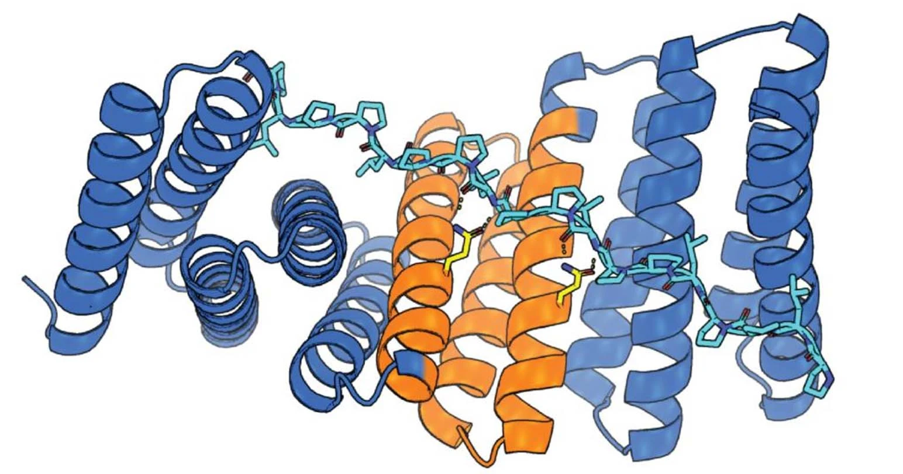

# Deep Learning for peptides

🔬 __Comprehensive List of Research Papers on Peptides and Deep Learning__

[](https://awesome.re)  [](https://github.com/zhaisilong/awesome-peptide)

🔗 Link directly to <a href="#contents">Contents</a>, <a href="#citations">Citations</a>

✅ __What sets us apart from similar resources:__

1. Versatile Tags: Organize and filter papers easily.
2. Easy Navigation: Internal links for quick jumps between sections and papers.
3. Expert Insights: Links to expert reviews and analysis.
4. Tag System: Quickly catch the paper features
5. [CSV Downloads](data/paper.csv): Quick access to paper data in `CSV` format.
6. Automation: Use [Liquid](https://liquid.readthedocs.io/en/latest/) templates to generate Markdown from `CSV`, making it easy to build your own paper repository. >>> [[Details](CONTRIBUTING.md)]

📅 _Papers last six month, updated on 2025-03-08:_

**Hotspot-Driven Peptide Design via Multi-Fragment Autoregressive Extension**  
Jiahan Li, Tong Chen, Shitong Luo, Chaoran Cheng, Jiaqi Guan, Ruihan Guo, Sheng Wang, Ge Liu, Jian Peng, Jianzhu Ma  
[**2024**-11-26] >> ICML/[arXiv](https://doi.org/10.48550/arXiv.2411.18463) • [Jianzhu Ma](https://scholar.google.com/citations?user=AATzYuAAAAAJ)/Flow

**Peptide-Aware Chemical Language Model Successfully Predicts Membrane Diffusion of Cyclic Peptides**  
Aaron L. Feller, Claus O. Wilke  
[**2024**-11-21] >> [bioRxiv](https://doi.org/10.1101/2024.08.09.607221) • Cyclic

**Accurate de Novo Design of High-Affinity Protein Binding Macrocycles Using Deep Learning**  
Stephen Rettie, ..., Gaurav Bhardwaj  
[**2024**-11-18] >> [bioRxiv](https://doi.org/10.1101/2024.11.18.622547) • high • [RFdiffusion](https://github.com/RosettaCommons/RFdiffusion)/[David Baker](https://scholar.google.com/citations?hl=en&user=UKqIqRsAAAAJ)/[Gaurav Bhardwaj](https://scholar.google.com/citations?user=AJSn9j0AAAAJ)/Cyclic

**PepDoRA: A Unified Peptide Language Model via Weight-Decomposed Low-Rank Adaptation**  
Leyao Wang, Rishab Pulugurta, Pranay Vure, Yinuo Zhang, Aastha Pal, and Pranam Chatterjee  
[**2024**-10-28] >> [arXiv](https://doi.org/10.48550/arXiv.2410.20667) • [GitHub](https://github.com/Ced3-han/PepFlowww) • [Pranam Chatterjee](https://scholar.google.co.uk/citations?user=XExgv9YAAAAJ)/MLM

**Improving Inverse Folding for Peptide Design with Diversity-Regularized Direct Preference Optimization**  
Ryan Park, Darren J. Hsu, C. Brian Roland, Chen Tessler, Maria Korshunova, Shie Mannor, Olivia Viessmann, Bruno Trentini  
[**2024**-10-25] >> [arXiv](https://doi.org/10.48550/arXiv.2410.19471) • [ProteinMPNN](https://www.science.org/doi/10.1126/science.add2187)/Nvidia

**Predicting 3D Structures of Lasso Peptides**  
Xingyu Ouyang, Xinchun Ran, Han Xu, Yi-Lei Zhao, A. James Link, Zhongyue Yang  
[**2024**-10-14] >> [ChemRxiv](https://doi.org/10.26434/chemrxiv-2024-q3rn0-v2) • [LassoPred](https://github.com/ChemBioHTP/LassoPred)/[Web](https://lassopred.accre.vanderbilt.edu/) • Lasso/[AF](https://deepmind.google/technologies/alphafold/)/ESM/MD
  
<details>
<summary>🔎 Abstract</summary>
<p>这篇文章围绕 LassoPred 工具展开，解决了现有工具无法准确预测 套索肽（Lasso peptides, LaPs） 结构的挑战。套索肽以其 绳结状拓扑结构 和 异肽键 特性，使传统的结构预测工具（如 AlphaFold 和 ESMfold）难以处理。</p>
</details>  

**Design of linear and cyclic peptide binders of different lengths from protein sequence information**  
Qiuzhen Li, Efstathios Nikolaos Vlachos, Patrick Bryant  
[**2024**-10-12] >> [Arxive](https://doi.org/10.1101/2024.06.20.599739) • [zenodo](https://zenodo.org/uploads/11543503) • [EvoBind](https://github.com/patrickbryant1/EvoBind) • Cyclic/[Patrick Bryant](https://scholar.google.com/citations?user=KPlaFQQAAAAJ)

**Discovery of antimicrobial peptides with notable antibacterial potency by an LLM-based foundation model**  
Jike Wang, Jianwen Feng, Yu Kang, Peichen Pan, Jingxuan Ge, Yan Wang, Mingyang Wang  
[**2024**-10-10] >> [Science Advances](https://doi.org/10.1126/sciadv.ads8932) • high • [Tingjun Hou](https://scholar.google.com/citations?hl=en&user=vHW2kqUAAAAJ)/Diffusion/[Chang-Yu Hsieh](https://scholar.google.com/citations?user=K-AjhSgAAAAJ&hl=en)

**Discovery of a Series of Macrocycles as Potent Inhibitors of Leishmania Infantum**  
Federico Riu, Larissa Alena Ruppitsch, Duc Duy Vo, Richard S. Hong, Mohit Tyagi, An Matheeussen, Sarah Hendrickx, Vasanthanathan Poongavanam, Guy Caljon, Ahmad Y. Sheikh, Peter Sjö, and Jan Kihlberg  
[**2024**-10-8] >> [J. Med. Chem.](https://doi.org/10.1021/acs.jmedchem.4c01370) • high • [Weixin](https://mp.weixin.qq.com/s/jisVUSzJu4t9BD3JFVb_-A) • Cyclic

**BindCraft: one-shot design of functional protein binders**  
Martin Pacesa, Lennart Nickel, ..., Sergey Ovchinnikov, Bruno E. Correia  
[**2024**-10-1] >> [Arxive](https://doi.org/10.1101/2024.09.30.615802) • high • [GitHub](https://github.com/martinpacesa/BindCraft) • [Weixin](https://mp.weixin.qq.com/s/U4akBYhlFbOhHfJl2R2blg)
  
<details>
<summary>🔎 Abstract</summary>
<p>BindCraft is an open-source, automated pipeline for <em>de novo</em> protein binder design, achieving experimental success rates of 10-100%. Using deep learning models like AlphaFold2, BindCraft generates high-affinity binders without the need for high-throughput screening or prior knowledge of binding sites. It has been successfully applied to challenging targets, including cell-surface receptors, allergens, and CRISPR-Cas9. In one example, the binders reduced IgE binding to birch allergens in patient samples, showcasing its potential in therapeutics, diagnostics, and biotechnology.</p>
</details>  

**PepINVENT: Generative peptide design beyond the natural amino acids**  
Gökçe Geylan, Jon Paul Janet, Alessandro Tibo, Jiazhen He, Atanas Patronov, Mikhail Kabeshov, Florian David, Werngard Czechtizky, Ola Engkvist, Leonardo De Maria  
[**2024**-9-21] >> [Axive](https://doi.org/10.48550/arXiv.2409.14040) • RL/[Molecular AI](https://github.com/molecularai)/AstraZeneca

**Beware of extreme calculated lipophilicity when designing cyclic peptides**  
Vasanthanathan Poongavanam, Duc Duy Vo & Jan Kihlberg  
[**2024**-9-19] >> [Nat. Chem. Biol.](https://doi.org/10.1038/s41589-024-01715-0) • [SI](https://www.nature.com/articles/s41589-024-01715-0#MOESM1) • [Weixin](https://mp.weixin.qq.com/s/B65rJB1i_xrP8fTfbQ3Taw) • Cyclic/clogP

📌 _Papers pined:_

**Hotspot-Driven Peptide Design via Multi-Fragment Autoregressive Extension**  
Jiahan Li, Tong Chen, Shitong Luo, Chaoran Cheng, Jiaqi Guan, Ruihan Guo, Sheng Wang, Ge Liu, Jian Peng, Jianzhu Ma  
[**2024**-11-26] >> ICML/[arXiv](https://doi.org/10.48550/arXiv.2411.18463) • [Jianzhu Ma](https://scholar.google.com/citations?user=AATzYuAAAAAJ)/Flow

**Accurate de Novo Design of High-Affinity Protein Binding Macrocycles Using Deep Learning**  
Stephen Rettie, ..., Gaurav Bhardwaj  
[**2024**-11-18] >> [bioRxiv](https://doi.org/10.1101/2024.11.18.622547) • high • [RFdiffusion](https://github.com/RosettaCommons/RFdiffusion)/[David Baker](https://scholar.google.com/citations?hl=en&user=UKqIqRsAAAAJ)/[Gaurav Bhardwaj](https://scholar.google.com/citations?user=AJSn9j0AAAAJ)/Cyclic

**Discovery of antimicrobial peptides with notable antibacterial potency by an LLM-based foundation model**  
Jike Wang, Jianwen Feng, Yu Kang, Peichen Pan, Jingxuan Ge, Yan Wang, Mingyang Wang  
[**2024**-10-10] >> [Science Advances](https://doi.org/10.1126/sciadv.ads8932) • high • [Tingjun Hou](https://scholar.google.com/citations?hl=en&user=vHW2kqUAAAAJ)/Diffusion/[Chang-Yu Hsieh](https://scholar.google.com/citations?user=K-AjhSgAAAAJ&hl=en)

**BindCraft: one-shot design of functional protein binders**  
Martin Pacesa, Lennart Nickel, ..., Sergey Ovchinnikov, Bruno E. Correia  
[**2024**-10-1] >> [Arxive](https://doi.org/10.1101/2024.09.30.615802) • high • [GitHub](https://github.com/martinpacesa/BindCraft) • [Weixin](https://mp.weixin.qq.com/s/U4akBYhlFbOhHfJl2R2blg)
  
<details>
<summary>🔎 Abstract</summary>
<p>BindCraft is an open-source, automated pipeline for <em>de novo</em> protein binder design, achieving experimental success rates of 10-100%. Using deep learning models like AlphaFold2, BindCraft generates high-affinity binders without the need for high-throughput screening or prior knowledge of binding sites. It has been successfully applied to challenging targets, including cell-surface receptors, allergens, and CRISPR-Cas9. In one example, the binders reduced IgE binding to birch allergens in patient samples, showcasing its potential in therapeutics, diagnostics, and biotechnology.</p>
</details>  

**PepINVENT: Generative peptide design beyond the natural amino acids**  
Gökçe Geylan, Jon Paul Janet, Alessandro Tibo, Jiazhen He, Atanas Patronov, Mikhail Kabeshov, Florian David, Werngard Czechtizky, Ola Engkvist, Leonardo De Maria  
[**2024**-9-21] >> [Axive](https://doi.org/10.48550/arXiv.2409.14040) • RL/[Molecular AI](https://github.com/molecularai)/AstraZeneca

**Target-Specific De Novo Peptide Binder Design with DiffPepBuilder**  
Fanhao Wang, Yuzhe Wang, Laiyi Feng, Changsheng Zhang, and Luhua Lai  
[**2024**-9-4] >> [JCIM](https://doi.org/10.1021/acs.jcim.4c00975) • high • [GitHub](https://github.com/YuzheWangPKU/DiffPepBuilder) • Diffusion/[Luhua Lai](https://scholar.google.com/citations?hl=en&user=8NJFCTYAAAAJ)/[ColabDesign](https://github.com/sokrypton/ColabDesign)/[ProteinMPNN](https://www.science.org/doi/10.1126/science.add2187)/MD
  
<details>
<summary>🔎 Abstract</summary>
<p>Despite the exciting progress in target-specific de novo protein binder design, peptide binder design remains challenging due to the flexibility of peptide structures and the scarcity of protein-peptide complex structure data. In this study, we curated a large synthetic data set, referred to as PepPC-F, from the abundant protein−protein interface data and developed DiffPepBuilder, a de novo target-specific peptide binder generation method that utilizes an SE(3)-equivariant diffusion model trained on PepPC-F to codesign peptide sequences and structures. DiffPepBuilder also introduces disulfide bonds to stabilize the generated peptide structures. We tested DiffPepBuilder on 30 experimentally verified strong peptide binders with available protein−peptide complex structures. DiffPepBuilder was able to effectively recall the native structures and sequences of the peptide ligands and to generate novel peptide binders with improved binding free energy. We subsequently conducted de novo generation case studies on three targets. In both the regeneration test and case studies, DiffPepBuilder outperformed AfDesign and RFdiffusion coupled with ProteinMPNN, in terms of sequence and structure recall, interface quality, and structural diversity. Molecular dynamics simulations confirmed that the introduction of disulfide bonds enhanced the structural rigidity and binding performance of the generated peptides. As a general peptide binder de novo design tool, DiffPepBuilder can be used to design peptide binders for given protein targets with three-dimensional and binding site information.</p>
</details>  

**CycPeptMP: Enhancing Membrane Permeability Prediction of Cyclic Peptides with Multi-Level Molecular Features and Data Augmentation**  
Jianan Li, Keisuke Yanagisawa, and Yutaka Akiyama  
[**2024**-9-1] >> [BIB](https://doi.org/10.1093/bib/bbae417) • high • [CycPeptMPDB](http://cycpeptmpdb.com/) • [GitHub](https://github.com/akiyamalab/cycpeptmp) • Cyclic/[Akiyama Yutaka](https://scholar.google.com/citations?hl=en&user=eHAafMgAAAAJ)

**Direct conformational sampling from peptide energy landscapes through hypernetwork-conditioned diffusion**  
Osama Abdin & Philip M. Kim  
[**2024**-6-27] >> [NMI](https://doi.org/10.1038/s42256-024-00860-4) • high • [data](http://pepflow.ccbr.proteinsolver.org) • [PepFlow](https://gitlab.com/oabdin/pepflow) • Cyclic/MD/Diffusion

**Full-Atom Peptide Design Based on Multi-Modal Flow Matching**  
Jiahan Li, Chaoran Cheng, Zuofan Wu, Ruihan Guo, Shitong Luo, Zhizhou Ren, Jian Peng, and Jianzhu Ma  
[**2024**-6-2] >> [arXiv](https://doi.org/10.48550/arXiv.2406.00735) • high • [GitHub](https://github.com/Ced3-han/PepFlowww) • [Jianzhu Ma](https://scholar.google.com/citations?user=AATzYuAAAAAJ)/Flow

**Full-Atom Peptide Design with Geometric Latent Diffusion**  
Xiangzhe Kong, Yinjun Jia, Wenbing Huang, Yang Liu  
[**2024**-2-21] >> NeurIPS/[Arxive](https://doi.org/10.48550/arXiv.2402.13555) • [code](https://github.com/THUNLP-MT/PepGLAD) • Full-Atom/Diffusion

**PepMLM: Target Sequence-Conditioned Generation of Peptide Binders via Masked Language Modeling**  
Tianlai Chen, Sarah Pertsemlidis, and Pranam Chatterjee  
[**2023**-10-5] >> [ICLR](https://doi.org/10.48550/arXiv.2310.03842) • high • [Pranam Chatterjee](https://scholar.google.co.uk/citations?user=XExgv9YAAAAJ)/MLM

**Improving de novo protein binder design with deep learning**  
Nathaniel R. Bennett, Brian Coventry, ..., David Baker  
[**2023**-5-6] >> [NC](https://doi.org/10.1038/s41467-023-38328-5) • high • [GitHub](https://github.com/nrbennet/dl_binder_design) • [RosettaCommons](https://www.rosettacommons.org)/[ProteinMPNN](https://www.science.org/doi/10.1126/science.add2187)

**Denovo design of modular peptide-binding proteins by superhelical matching**  
Kejia Wu, Hua Bai, ..., Emmanuel Derivery, Daniel Adriano Silva, David Baker  
[**2023**-3-5] >> [Nature](https://doi.org/10.1038/s41586-023-05909-9) • high • [data](https://files.ipd.uw.edu/pub/2023_modular_peptide_binding_proteins/all_data_modular_peptide_binding_proteins.tar.gz) • [GitHub](https://github.com/tjs23/prot_pep_scan) • [David Baker](https://scholar.google.com/citations?hl=en&user=UKqIqRsAAAAJ)
  
<details>
<summary>🔎 Abstract</summary>
<p>General approaches for designing sequence-specific peptide-binding proteins would have wide utility in proteomics and synthetic biology. However, designing peptide-binding proteins is challenging, as most peptides do not have defined structures in isolation, and hydrogen bonds must be made to the buried polar groups in the peptide backbone1–3. Here, inspired by natural and re-engineered proteinpeptide systems4–11, we set out to design proteins made out of repeating units that bind peptides with repeating sequences, with a one-to-one correspondence between the repeat units of the protein and those of the peptide. We use geometric hashing to identify protein backbones and peptide-docking arrangements that are compatible with bidentate hydrogen bonds between the side chains of the protein and the peptide backbone12. The remainder of the protein sequence is then optimized for folding and peptide binding. We design repeat proteins to bind to six different tripeptide-repeat sequences in polyproline II conformations. The proteins are hyperstable and bind to four to six tandem repeats of their tripeptide targets with nanomolar to picomolar affinities in vitro and in living cells. Crystal structures reveal repeating interactions between protein and peptide interactions as designed, including ladders of hydrogen bonds from protein side chains to peptide backbones. By redesigning the binding interfaces of individual repeat units, specificity can be achieved for non-repeating peptide sequences and for disordered regions of native proteins.</p>
</details>  

**Target structure based computational design of cyclic peptides**  
WANG Fanhao, LAI Luhua, ZHANG Changsheng  
[**2023**-1-1] >> [SynbioJ](https://doi.org/10.12211/2096-8280.2023-006) • high • [pdf](./resource/10.12211/2096-8280.2023-006.pdf) • Cyclic/MD/[Luhua Lai](https://scholar.google.com/citations?hl=en&user=8NJFCTYAAAAJ)

**Design of Protein Segments and Peptides for Binding to Protein Targets**  
Suchetana Gupta, Noora Azadvari, and Parisa Hosseinzadeh  
[**2022**-1-1] >> [BioDesign Research](https://doi.org/10.34133/2022/9783197) • high

**Anchor extension: a structure-guided approach to  design cyclic peptides targeting enzyme active sites**  
Parisa Hosseinzadeh, ..., David Baker  
[**2021**-7-7] >> [NC](https://doi.org/10.1038/s41467-021-23609-8) • [Peptide_HDACBinders](https://github.com/ParisaH-Lab/publications.git) • [Tencent](https://cloud.tencent.com/developer/article/1880256) • Cyclic/[David Baker](https://scholar.google.com/citations?hl=en&user=UKqIqRsAAAAJ)/MD/Crystal

**Elucidating Solution Structures of Cyclic Peptides Using Molecular Dynamics Simulations**  
Jovan Damjanovic, Jiayuan Miao, He Huang, Yu-Shan Lin  
[**2021**-1-11] >> [Chemical Reviews](https://doi.org/10.1021/acs.chemrev.0c01087) • high • Cyclic/MD

**Strategies for Fine-Tuning the Conformations of Cyclic Peptides**  
Rasha Jwad, Daniel Weissberger, and Luke Hunter  
[**2020**-8-5] >> [Chem. Rev.](https://doi.org/10.1021/acs.chemrev.0c00013) • high • Cyclic

---

<p align="center">
  <a href="https://doi.org/10.1038/s41586-023-05909-9">
  
  </a>
</p>

<p id="contents" align='center'>
  <strong><a href='#0-benchmarks-and-datasets'>0) Benchmarks and Datasets</a></strong>
  <br>
  <a href="#01-benchmarks">Benchmarks</a> •
  <a href="#02-datasets">Datasets</a> •
  <a href="#03-similar-list">Similar List</a> •
  <a href="#04-tools">Tools</a>
  <br>
  <strong><a href='#1-reviews'>1) Reviews</a></strong>
  <br><a href='#11-design'>Design</a> • 
  <a href='#12-interaction'>Interaction</a> • 
  <a href='#13-property'>Property</a> • 
  <a href='#14-structure'>Structure</a>
  <br>
  <strong><a href='#2-representation'>2) Representation</a></strong>
  <br>
  <strong><a href='#3-proprty-prediction'>3) Proprty Prediction</a></strong>
  <br><a href='#31-sequence-based'>Sequence-based</a> • 
  <a href='#32-structure-based'>Structure-based</a>
  <br>
  <strong><a href='#4-structure-modeling'>4) Structure Modeling</a></strong>
  <br><a href='#41-complex'>Complex</a> • 
  <a href='#42-monomer'>Monomer</a>
  <br>
  <strong><a href='#5-interaction-modeling'>5) Interaction Modeling</a></strong>
  <br><a href='#51-grpah-based'>Grpah-based</a>
  <br>
  <strong><a href='#6-design'>6) Design</a></strong>
  <br><a href='#61-graph-based'>Graph-based</a> • 
  <a href='#62-sequence-based'>Sequence-based</a> • 
  <a href='#63-structure-based'>Structure-based</a> • 
  <a href='#64-traditional'>Traditional</a>
  <br>
  <strong><a href='#7-others'>7) Others</a></strong>
  <br><a href='#71-protac'>PROTAC</a> • 
  <a href='#72-principle'>Principle</a> • 
  <a href='#73-protein-binders'>Protein Binders</a> • 
  <a href='#74-rapid'>RaPID</a> • 
  <a href='#75-screen'>Screen</a> • 
  <a href='#76-therapeutic'>Therapeutic</a>
  <br>
</p>

---

## 0. Benchmarks and Datasets

### 0.1 Benchmarks

#### 0.1.1 Sequence Benchmarks

#### 0.1.2 Structure Benchmarks

**Predicting Protein−Peptide Interactions: Benchmarking Deep Learning Techniques and a Comparison with Focused Docking**  
Sudhanshu Shanker and Michel F. Sanner  
[**2024**-5-11] >> [JCIM](https://doi.org/10.1021/acs.jcim.3c00602) • [GitHub](https://github.com/sannerlab/benchmarking_2023) • Fold

**Comprehensive Evaluation of 10 Docking Programs on a Diverse Set of Protein−Cyclic Peptide Complexes**
Huifeng Zhao, Dejun Jiang, Chao Shen, Jintu Zhang, Xujun Zhang, Xiaorui Wang, Dou Nie, Tingjun Hou, and Yu Kang  
[**2024**-2-29] >> [JCIM](https://doi.org/10.1021/acs.jcim.3c01921) • [CPSet](https://github.com/huifengzhao/CPSet) • [Tingjun Hou](https://scholar.google.com/citations?hl=en&user=vHW2kqUAAAAJ)

**Benchmarking AlphaFold2 on peptide structure prediction**  
Eli Fritz McDonald, Taylor Jones, Lars Plate, Jens Meiler, Alican Gulsevin  
[**2024**-1-5] >> [Structure](https://doi.org/10.1016/j.str.2022.11.012) • [SI](https://doi.org/10.1016/j.str.2022.11.012) • [Weixin](https://mp.weixin.qq.com/s/9mpyZXITVC6RBbNQmjJLcg) • [AF](https://deepmind.google/technologies/alphafold/)

**Comprehensive Evaluation of Fourteen Docking Programs on Protein−Peptide Complexes**  
Gaoqi Weng, Junbo Gao, Zhe Wang, Ercheng Wang, Xueping Hu, Xiaojun Yao, Dongsheng Cao & Tingjun Hou  
[**2020**-3-23] >> [JCTC](https://doi.org/10.1021/acs.jctc.9b01208) • [pepset](http://cadd.zju.edu.cn/pepset/) • high • [Tingjun Hou](https://scholar.google.com/citations?hl=en&user=vHW2kqUAAAAJ)

**Highly Flexible Ligand Docking: Benchmarking of the DockThor Program on the LEADS-PEP Protein−Peptide Data Set**  
Karina B. Santos, Isabella A. Guedes, Ana L. M. Karl, and Laurent E. Dardenne  
[**2020**-1-10] >> [JCIM](https://doi.org/10.1021/acs.jcim.9b00905) • [DockerThor](https://www.dockthor.lncc.br) • MD

#### 0.1.3 Evaluations

### 0.2 Datasets

### 0.2.1 Public Datasets

> A list of suggested peptide datasets

| Datasets    | Description                                                                                                                                                                                                                                                         | Link                                  |
| ----------- | ------------------------------------------------------------------------------------------------------------------------------------------------------------------------------------------------------------------------------------------------------------------- | ------------------------------------- |
| CycPeptMPDB | CycPeptMPDB, the first web-accessible database of cyclic peptide membrane permeability.                                                                                                                                                                             | [CycPeptMPDB](http://cycpeptmpdb.com) |

#### 0.2.1 Sequence Datasets

**CycPeptMPDB: A Comprehensive Database of Membrane Permeability of Cyclic Peptides**  
Jianan Li, Keisuke Yanagisawa, Masatake Sugita, Takuya Fujie, Masahito Ohue & Yutaka Akiyama  
[**2023**-3-17] >> [JCIM](https://doi.org/10.1021/acs.jcim.2c01573) • [CycPeptMPDB](http://cycpeptmpdb.com) • [Akiyama Yutaka](https://scholar.google.com/citations?hl=en&user=eHAafMgAAAAJ)

#### 0.2.2 Structure Datasets

### 0.3 Similar List

> Some similar GitHub lists that include papers about peptide using deep learning

1. Similar List 1
2. Similar List 2

### 0.4 Guides

> Guides/Tutorials for beginners on GitHub

1. Tutorials 1
2. Tutorials 2

### 0.5 Tools

1. HELM
   1. [HELM Online](http://webeditor.openhelm.org/hwe/examples/App.htm)
   2. [HELM Doc](https://pistoiaalliance.atlassian.net/wiki/spaces/PUB/pages/35028994/HELM+Web-editor)
   3. [HELM GitHub HELMWebEditor](https://github.com/PistoiaHELM/HELMWebEditor)
2. PDB
   1. [pdb-tools](http://www.bonvinlab.org/pdb-tools/)
   2. [BioPython](https://biopython.org)
   3. [BioPandas](https://biopandas.github.io/biopandas/)
   4. [RDKit](https://www.rdkit.org)
3. Interaction
   1. [Protein-Ligand Interaction Profiler, PLIP](https://plip-tool.biotec.tu-dresden.de/plip-web/plip/index)

## 1. Reviews

### 1.1 Design

**Unlocking novel therapies: cyclic peptide design for amyloidogenic targets through synergies of experiments, simulations, and machine learning**  
Daria de Raffele and Ioana M. Ilie  
[**2023**-11-7] >> [Chem. Commun.](https://doi.org/10.1039/D3CC04630C) • Cyclic

**Target structure based computational design of cyclic peptides**  
WANG Fanhao, LAI Luhua, ZHANG Changsheng  
[**2023**-1-1] >> [SynbioJ](https://doi.org/10.12211/2096-8280.2023-006) • high • [pdf](./resource/10.12211/2096-8280.2023-006.pdf) • Cyclic/MD/[Luhua Lai](https://scholar.google.com/citations?hl=en&user=8NJFCTYAAAAJ)

**Design of Protein Segments and Peptides for Binding to Protein Targets**  
Suchetana Gupta, Noora Azadvari, and Parisa Hosseinzadeh  
[**2022**-1-1] >> [BioDesign Research](https://doi.org/10.34133/2022/9783197) • high


### 1.2 Interaction

**A comprehensive review of protein-centric predictors for biomolecular interactions: from proteins to nucleic acids and beyond**  
Pengzhen Jia, Fuhao Zhang, Chaojin Wu and Min Li  
[**2024**-3-31] >> [BIB](https://doi.org/10.1093/bib/bbae162)


### 1.3 Property

**Machine learning for antimicrobial peptide identification and design**  
Fangping Wan, Felix Wong, James J. Collins & Cesar de la Fuente-Nunez  
[**2024**-2-26] >> [Nat Rev Bioeng](https://doi.org/10.1038/s44222-024-00152-x) • AMPs


### 1.4 Structure

**Modelling peptide–protein complexes: docking, simulations and machine learning**  
Arup Mondal, Liwei Chang and Alberto Perez  
[**2022**-8-26] >> [QRB Discovery](https://doi.org/10.1017/qrd.2022.14)

**Strategies for Fine-Tuning the Conformations of Cyclic Peptides**  
Rasha Jwad, Daniel Weissberger, and Luke Hunter  
[**2020**-8-5] >> [Chem. Rev.](https://doi.org/10.1021/acs.chemrev.0c00013) • high • Cyclic


## 2. Representation

## 3. Proprty Prediction

### 3.1 Sequence-based

**Peptide-Aware Chemical Language Model Successfully Predicts Membrane Diffusion of Cyclic Peptides**  
Aaron L. Feller, Claus O. Wilke  
[**2024**-11-21] >> [bioRxiv](https://doi.org/10.1101/2024.08.09.607221) • Cyclic


### 3.2 Structure-based

**CycPeptMP: Enhancing Membrane Permeability Prediction of Cyclic Peptides with Multi-Level Molecular Features and Data Augmentation**  
Jianan Li, Keisuke Yanagisawa, and Yutaka Akiyama  
[**2024**-9-1] >> [BIB](https://doi.org/10.1093/bib/bbae417) • high • [CycPeptMPDB](http://cycpeptmpdb.com/) • [GitHub](https://github.com/akiyamalab/cycpeptmp) • Cyclic/[Akiyama Yutaka](https://scholar.google.com/citations?hl=en&user=eHAafMgAAAAJ)


## 4. Structure Modeling

### 4.1 Complex

**HighFold: accurately predicting structures of cyclic  peptides and complexes with head-to-tail and disulfide  bridge constraints**  
Chenhao Zhang, Chengyun Zhang, Tianfeng Shang, Ning Zhu, Xinyi Wu, Hongliang Duan  
[**2024**-3-18] >> [BIB](https://doi.org/10.1093/bib/bbae215) • [HighFold](https://github.com/hongliangduan/HighFold) • [Hongliang Duan](https://www.mpu.edu.mo/esca/en/duanhongliang.php)/Cyclic/[AF](https://deepmind.google/technologies/alphafold/)

**Ranking Peptide Binders by Affinity with AlphaFold**  
Liwei Chang and Alberto Perez  
[**2022**-11-21] >> [Angew](https://doi.org/10.1002/anie.202213362) • [AF](https://deepmind.google/technologies/alphafold/)

**Harnessing protein folding neural networks for  peptide–protein docking**  
Tomer Tsaban, Julia K. Varga, Orly Avraham, Ziv Ben-Aharon, Alisa Khramushin &  Ora Schueler-Furman  
[**2021**-11-10] >> [NC](https://doi.org/10.1038/s41467-021-27838-9) • [GitHub](https://github.com/Furman-Lab/Peptide_docking_with_AF2_and_RosettAfold) • [AF](https://deepmind.google/technologies/alphafold/)


### 4.2 Monomer

**Predicting 3D Structures of Lasso Peptides**  
Xingyu Ouyang, Xinchun Ran, Han Xu, Yi-Lei Zhao, A. James Link, Zhongyue Yang  
[**2024**-10-14] >> [ChemRxiv](https://doi.org/10.26434/chemrxiv-2024-q3rn0-v2) • [LassoPred](https://github.com/ChemBioHTP/LassoPred)/[Web](https://lassopred.accre.vanderbilt.edu/) • Lasso/[AF](https://deepmind.google/technologies/alphafold/)/ESM/MD
  
<details>
<summary>🔎 Abstract</summary>
<p>这篇文章围绕 LassoPred 工具展开，解决了现有工具无法准确预测 套索肽（Lasso peptides, LaPs） 结构的挑战。套索肽以其 绳结状拓扑结构 和 异肽键 特性，使传统的结构预测工具（如 AlphaFold 和 ESMfold）难以处理。</p>
</details>  

**Direct conformational sampling from peptide energy landscapes through hypernetwork-conditioned diffusion**  
Osama Abdin & Philip M. Kim  
[**2024**-6-27] >> [NMI](https://doi.org/10.1038/s42256-024-00860-4) • high • [data](http://pepflow.ccbr.proteinsolver.org) • [PepFlow](https://gitlab.com/oabdin/pepflow) • Cyclic/MD/Diffusion

**Structure prediction of linear and cyclic peptides using  CABS-flex**  
Aleksandra Badaczewska-Dawid, Karol Wróblewski, Mateusz Kurcinski & Sebastian Kmiecik  
[**2023**-11-28] >> [BIB](https://doi.org/10.1093/bib/bbae003) • MD/Cyclic

**Elucidating Solution Structures of Cyclic Peptides Using Molecular Dynamics Simulations**  
Jovan Damjanovic, Jiayuan Miao, He Huang, Yu-Shan Lin  
[**2021**-1-11] >> [Chemical Reviews](https://doi.org/10.1021/acs.chemrev.0c01087) • high • Cyclic/MD


## 5. Interaction Modeling

### 5.1 Grpah-based

**Deep-learning-based prediction framework for protein-peptide interactions with structure generation pipeline**  
Jingxuan Ge, Dejun Jiang, ..., Chang-Yu Hsieh, Tingjun Hou  
[**2024**-6-19] >> [Cell Rep. Phys. Sci.](https://doi.org/10.1016/j.xcrp.2024.101980) • [zenodo](https://doi.org/10.5281/zenodo.8324920) • [ITN](https://github.com/gejingxuan/ITN) • [AF](https://deepmind.google/technologies/alphafold/)/[Tingjun Hou](https://scholar.google.com/citations?hl=en&user=vHW2kqUAAAAJ)

**Propedia v2.3: A novel  representation approach for the  peptide-protein interaction  database using graph-based  structural signatures**  
Pedro Martins, Diego Mariano, Frederico Chaves Carvalho, Luana Luiza Bastos, Lucas Moraes, Vivian Paixão and Raquel Cardoso de Melo-Minardi  
[**2023**-2-16] >> [Front. Bioinform.](https://doi.org/10.3389/fbinf.2023.1103103) • [SI](https://www.frontiersin.org/journals/bioinformatics/articles/10.3389/fbinf.2023.1103103/full#SM1) • [propedia](https://github.com/LBS-UFMG/propedia)


## 6. Design

### 6.1 Graph-based

**Reinforcement learning-driven exploration of peptide space: accelerating generation of drug-like peptides**  
Qian Wang, Xiaotong Hu, Zhiqiang Wei, Hao Lu , Hao Liu  
[**2024**-8-27] >> [BIB](https://doi.org/10.1093/bib/bbae444) • [MondTDSRL](https://github.com/p1acemker/MomdTDSRL.git) • RL/MD

**Improving de novo protein binder design with deep learning**  
Nathaniel R. Bennett, Brian Coventry, ..., David Baker  
[**2023**-5-6] >> [NC](https://doi.org/10.1038/s41467-023-38328-5) • high • [GitHub](https://github.com/nrbennet/dl_binder_design) • [RosettaCommons](https://www.rosettacommons.org)/[ProteinMPNN](https://www.science.org/doi/10.1126/science.add2187)


### 6.2 Sequence-based

**PepDoRA: A Unified Peptide Language Model via Weight-Decomposed Low-Rank Adaptation**  
Leyao Wang, Rishab Pulugurta, Pranay Vure, Yinuo Zhang, Aastha Pal, and Pranam Chatterjee  
[**2024**-10-28] >> [arXiv](https://doi.org/10.48550/arXiv.2410.20667) • [GitHub](https://github.com/Ced3-han/PepFlowww) • [Pranam Chatterjee](https://scholar.google.co.uk/citations?user=XExgv9YAAAAJ)/MLM

**Improving Inverse Folding for Peptide Design with Diversity-Regularized Direct Preference Optimization**  
Ryan Park, Darren J. Hsu, C. Brian Roland, Chen Tessler, Maria Korshunova, Shie Mannor, Olivia Viessmann, Bruno Trentini  
[**2024**-10-25] >> [arXiv](https://doi.org/10.48550/arXiv.2410.19471) • [ProteinMPNN](https://www.science.org/doi/10.1126/science.add2187)/Nvidia

**Design of linear and cyclic peptide binders of different lengths from protein sequence information**  
Qiuzhen Li, Efstathios Nikolaos Vlachos, Patrick Bryant  
[**2024**-10-12] >> [Arxive](https://doi.org/10.1101/2024.06.20.599739) • [zenodo](https://zenodo.org/uploads/11543503) • [EvoBind](https://github.com/patrickbryant1/EvoBind) • Cyclic/[Patrick Bryant](https://scholar.google.com/citations?user=KPlaFQQAAAAJ)

**Discovery of antimicrobial peptides with notable antibacterial potency by an LLM-based foundation model**  
Jike Wang, Jianwen Feng, Yu Kang, Peichen Pan, Jingxuan Ge, Yan Wang, Mingyang Wang  
[**2024**-10-10] >> [Science Advances](https://doi.org/10.1126/sciadv.ads8932) • high • [Tingjun Hou](https://scholar.google.com/citations?hl=en&user=vHW2kqUAAAAJ)/Diffusion/[Chang-Yu Hsieh](https://scholar.google.com/citations?user=K-AjhSgAAAAJ&hl=en)

**PepINVENT: Generative peptide design beyond the natural amino acids**  
Gökçe Geylan, Jon Paul Janet, Alessandro Tibo, Jiazhen He, Atanas Patronov, Mikhail Kabeshov, Florian David, Werngard Czechtizky, Ola Engkvist, Leonardo De Maria  
[**2024**-9-21] >> [Axive](https://doi.org/10.48550/arXiv.2409.14040) • RL/[Molecular AI](https://github.com/molecularai)/AstraZeneca

**Design of Peptide Binders to Conformationally Diverse Targets with Contrastive Language Modeling**  
Suhaas Bhat, Kalyan Palepu, ..., Pranam Chatterjee  
[**2024**-7-22] >> [Arxive](https://doi.org/10.1101/2023.06.26.546591) • [zenodo](https://zenodo.org/doi/10.5281/zenodo.10971077) • [huggingface](https://huggingface.co/ubiquitx/pepprclip) • Pipline
  
<details>
<summary>🔎 Abstract</summary>
<p>针对难以成药的蛋白质设计结合剂是药物开发中的难题，尤其是无序或构象不稳定的蛋白。我们提出了一种通用算法框架，利用目标蛋白的氨基酸序列设计短链线性多肽。通过对ESM-2蛋白语言模型的潜在空间进行高斯扰动生成多肽候选序列，并通过基于CLIP的对比学习架构筛选靶向选择性。最终创建了Peptide Prioritization via CLIP（PepPrCLIP）管道，并在实验中验证了这些多肽的有效性，既可作为抑制剂，也可通过与E3泛素连接酶融合降解多种蛋白靶标。该策略无需稳定的三级结构，能够靶向无序和难以成药的蛋白质，如转录因子和融合致癌蛋白。</p>
</details>  

**HELM-GPT: de novo macrocyclic peptide design using generative pre-trained transformer**  
Xiaopeng Xu,   Chencheng Xu, Wenjia He, Lesong Wei, Haoyang Li, Juexiao Zhou, Ruochi Zhang, Yu Wang, Yuanpeng Xiong, Xin Gao  
[**2024**-6-12] >> [Bioinformatics](https://doi.org/10.1093/bioinformatics/btae364) • [Github](https://github.com/charlesxu90/helm-gpt) • GPT/HELM/Cyclic/RL

**PepMLM: Target Sequence-Conditioned Generation of Peptide Binders via Masked Language Modeling**  
Tianlai Chen, Sarah Pertsemlidis, and Pranam Chatterjee  
[**2023**-10-5] >> [ICLR](https://doi.org/10.48550/arXiv.2310.03842) • high • [Pranam Chatterjee](https://scholar.google.co.uk/citations?user=XExgv9YAAAAJ)/MLM


### 6.3 Structure-based

**Hotspot-Driven Peptide Design via Multi-Fragment Autoregressive Extension**  
Jiahan Li, Tong Chen, Shitong Luo, Chaoran Cheng, Jiaqi Guan, Ruihan Guo, Sheng Wang, Ge Liu, Jian Peng, Jianzhu Ma  
[**2024**-11-26] >> ICML/[arXiv](https://doi.org/10.48550/arXiv.2411.18463) • [Jianzhu Ma](https://scholar.google.com/citations?user=AATzYuAAAAAJ)/Flow

**Accurate de Novo Design of High-Affinity Protein Binding Macrocycles Using Deep Learning**  
Stephen Rettie, ..., Gaurav Bhardwaj  
[**2024**-11-18] >> [bioRxiv](https://doi.org/10.1101/2024.11.18.622547) • high • [RFdiffusion](https://github.com/RosettaCommons/RFdiffusion)/[David Baker](https://scholar.google.com/citations?hl=en&user=UKqIqRsAAAAJ)/[Gaurav Bhardwaj](https://scholar.google.com/citations?user=AJSn9j0AAAAJ)/Cyclic

**Target-Specific De Novo Peptide Binder Design with DiffPepBuilder**  
Fanhao Wang, Yuzhe Wang, Laiyi Feng, Changsheng Zhang, and Luhua Lai  
[**2024**-9-4] >> [JCIM](https://doi.org/10.1021/acs.jcim.4c00975) • high • [GitHub](https://github.com/YuzheWangPKU/DiffPepBuilder) • Diffusion/[Luhua Lai](https://scholar.google.com/citations?hl=en&user=8NJFCTYAAAAJ)/[ColabDesign](https://github.com/sokrypton/ColabDesign)/[ProteinMPNN](https://www.science.org/doi/10.1126/science.add2187)/MD
  
<details>
<summary>🔎 Abstract</summary>
<p>Despite the exciting progress in target-specific de novo protein binder design, peptide binder design remains challenging due to the flexibility of peptide structures and the scarcity of protein-peptide complex structure data. In this study, we curated a large synthetic data set, referred to as PepPC-F, from the abundant protein−protein interface data and developed DiffPepBuilder, a de novo target-specific peptide binder generation method that utilizes an SE(3)-equivariant diffusion model trained on PepPC-F to codesign peptide sequences and structures. DiffPepBuilder also introduces disulfide bonds to stabilize the generated peptide structures. We tested DiffPepBuilder on 30 experimentally verified strong peptide binders with available protein−peptide complex structures. DiffPepBuilder was able to effectively recall the native structures and sequences of the peptide ligands and to generate novel peptide binders with improved binding free energy. We subsequently conducted de novo generation case studies on three targets. In both the regeneration test and case studies, DiffPepBuilder outperformed AfDesign and RFdiffusion coupled with ProteinMPNN, in terms of sequence and structure recall, interface quality, and structural diversity. Molecular dynamics simulations confirmed that the introduction of disulfide bonds enhanced the structural rigidity and binding performance of the generated peptides. As a general peptide binder de novo design tool, DiffPepBuilder can be used to design peptide binders for given protein targets with three-dimensional and binding site information.</p>
</details>  

**Full-Atom Peptide Design Based on Multi-Modal Flow Matching**  
Jiahan Li, Chaoran Cheng, Zuofan Wu, Ruihan Guo, Shitong Luo, Zhizhou Ren, Jian Peng, and Jianzhu Ma  
[**2024**-6-2] >> [arXiv](https://doi.org/10.48550/arXiv.2406.00735) • high • [GitHub](https://github.com/Ced3-han/PepFlowww) • [Jianzhu Ma](https://scholar.google.com/citations?user=AATzYuAAAAAJ)/Flow

**Full-Atom Peptide Design with Geometric Latent Diffusion**  
Xiangzhe Kong, Yinjun Jia, Wenbing Huang, Yang Liu  
[**2024**-2-21] >> NeurIPS/[Arxive](https://doi.org/10.48550/arXiv.2402.13555) • [code](https://github.com/THUNLP-MT/PepGLAD) • Full-Atom/Diffusion

**Denovo design of modular peptide-binding proteins by superhelical matching**  
Kejia Wu, Hua Bai, ..., Emmanuel Derivery, Daniel Adriano Silva, David Baker  
[**2023**-3-5] >> [Nature](https://doi.org/10.1038/s41586-023-05909-9) • high • [data](https://files.ipd.uw.edu/pub/2023_modular_peptide_binding_proteins/all_data_modular_peptide_binding_proteins.tar.gz) • [GitHub](https://github.com/tjs23/prot_pep_scan) • [David Baker](https://scholar.google.com/citations?hl=en&user=UKqIqRsAAAAJ)
  
<details>
<summary>🔎 Abstract</summary>
<p>General approaches for designing sequence-specific peptide-binding proteins would have wide utility in proteomics and synthetic biology. However, designing peptide-binding proteins is challenging, as most peptides do not have defined structures in isolation, and hydrogen bonds must be made to the buried polar groups in the peptide backbone1–3. Here, inspired by natural and re-engineered proteinpeptide systems4–11, we set out to design proteins made out of repeating units that bind peptides with repeating sequences, with a one-to-one correspondence between the repeat units of the protein and those of the peptide. We use geometric hashing to identify protein backbones and peptide-docking arrangements that are compatible with bidentate hydrogen bonds between the side chains of the protein and the peptide backbone12. The remainder of the protein sequence is then optimized for folding and peptide binding. We design repeat proteins to bind to six different tripeptide-repeat sequences in polyproline II conformations. The proteins are hyperstable and bind to four to six tandem repeats of their tripeptide targets with nanomolar to picomolar affinities in vitro and in living cells. Crystal structures reveal repeating interactions between protein and peptide interactions as designed, including ladders of hydrogen bonds from protein side chains to peptide backbones. By redesigning the binding interfaces of individual repeat units, specificity can be achieved for non-repeating peptide sequences and for disordered regions of native proteins.</p>
</details>  


### 6.4 Traditional

**Anchor extension: a structure-guided approach to  design cyclic peptides targeting enzyme active sites**  
Parisa Hosseinzadeh, ..., David Baker  
[**2021**-7-7] >> [NC](https://doi.org/10.1038/s41467-021-23609-8) • [Peptide_HDACBinders](https://github.com/ParisaH-Lab/publications.git) • [Tencent](https://cloud.tencent.com/developer/article/1880256) • Cyclic/[David Baker](https://scholar.google.com/citations?hl=en&user=UKqIqRsAAAAJ)/MD/Crystal


## 7. Others

### 7.1 PROTAC

**A Top-Down Design Approach for Generating a Peptide PROTAC Drug Targeting Androgen Receptor for Androgenetic Alopecia Therapy**  
Bohan Ma, Donghua Liu, Zhe Wang, Dize Zhang, Yanlin Jian, et. al.  
[**2021**-6-5] >> [JMC](https://doi.org/10.1021/acs.jmedchem.4c00828) • [Weixin](https://mp.weixin.qq.com/s/xeJWFVcV5LkIlVJ1Zxf5Eg) • PROTAC


### 7.2 Principle

**Discovery of a Series of Macrocycles as Potent Inhibitors of Leishmania Infantum**  
Federico Riu, Larissa Alena Ruppitsch, Duc Duy Vo, Richard S. Hong, Mohit Tyagi, An Matheeussen, Sarah Hendrickx, Vasanthanathan Poongavanam, Guy Caljon, Ahmad Y. Sheikh, Peter Sjö, and Jan Kihlberg  
[**2024**-10-8] >> [J. Med. Chem.](https://doi.org/10.1021/acs.jmedchem.4c01370) • high • [Weixin](https://mp.weixin.qq.com/s/jisVUSzJu4t9BD3JFVb_-A) • Cyclic

**Beware of extreme calculated lipophilicity when designing cyclic peptides**  
Vasanthanathan Poongavanam, Duc Duy Vo & Jan Kihlberg  
[**2024**-9-19] >> [Nat. Chem. Biol.](https://doi.org/10.1038/s41589-024-01715-0) • [SI](https://www.nature.com/articles/s41589-024-01715-0#MOESM1) • [Weixin](https://mp.weixin.qq.com/s/B65rJB1i_xrP8fTfbQ3Taw) • Cyclic/clogP


### 7.3 Protein Binders

**BindCraft: one-shot design of functional protein binders**  
Martin Pacesa, Lennart Nickel, ..., Sergey Ovchinnikov, Bruno E. Correia  
[**2024**-10-1] >> [Arxive](https://doi.org/10.1101/2024.09.30.615802) • high • [GitHub](https://github.com/martinpacesa/BindCraft) • [Weixin](https://mp.weixin.qq.com/s/U4akBYhlFbOhHfJl2R2blg)
  
<details>
<summary>🔎 Abstract</summary>
<p>BindCraft is an open-source, automated pipeline for <em>de novo</em> protein binder design, achieving experimental success rates of 10-100%. Using deep learning models like AlphaFold2, BindCraft generates high-affinity binders without the need for high-throughput screening or prior knowledge of binding sites. It has been successfully applied to challenging targets, including cell-surface receptors, allergens, and CRISPR-Cas9. In one example, the binders reduced IgE binding to birch allergens in patient samples, showcasing its potential in therapeutics, diagnostics, and biotechnology.</p>
</details>  


### 7.4 RaPID

**The RaPID Platform for the Discovery of Pseudo-Natural Macrocyclic Peptides**  
Yuki Goto & Hiroaki Suga  
[**2021**-9-10] >> [Acc. Chem. Res.](https://doi.org/10.1021/acs.accounts.1c00391) • RaPID/Cyclic/[Hiroaki Suga](https://www.chem.s.u-tokyo.ac.jp/users/bioorg/English/member/Suga.html)/mRNA


### 7.5 Screen

**A Computational Pipeline for Accurate Prioritization of Protein-Protein Binding Candidates in High-Throughput Protein Libraries**  
Arup Mondal, Bhumika Singh, Roland H. Felkner, Anna De Falco, GVT Swapna, Gaetano T. Montelione, Monica J. Roth, and Alberto Perez  
[**2024**-6-10] >> [Angew](https://doi.org/10.1002/anie.202405767) • high • [AF](https://deepmind.google/technologies/alphafold/)


### 7.6 Therapeutic

**Converting peptides into drugs  targeting intracellular  protein–protein interactions**  
Grégoire J.B. Philippe, David J. Craik and Sónia T. Henriques  
[**2021**-6-1] >> [Drug Discov Today](https://doi.org/10.1016/j.drudis.2021.01.022)

**Trends in peptide drug discovery**  
Markus Muttenthaler, Glenn F. King, David J. Adams and Paul F. Alewood  
[**2021**-4-1] >> [Nature Reviews Drug Discovery](https://doi.org/10.1038/s41573-020-00135-8) • high

**A Global Review on Short Peptides: Frontiers and Perspectives**  
Vasso Apostolopoulos, Joanna Bojarska, ...  
[**2021**-1-15] >> [Molecules](https://doi.org/10.3390/molecules26020430)


## Cntribution

[Contributions](https://github.com/zhaisilong/awesome-peptide/blob/main/CONTRIBUTING.md) and [suggestions](https://github.com/zhaisilong/awesome-peptide/issues) are warmly welcome! Community Values, Guiding Principles, and Commitments for the Responsible Development of AI for Peptide Design

## See Also

- [List of papers about Protein Design using Deep Learning](https://github.com/Peldom/papers_for_protein_design_using_DL)
- [Machine learning for proteins](https://github.com/yangkky/Machine-learning-for-proteins)

## Citations


```bibtex
@article{zhaiArtificialIntelligencePeptidebased2025,
  title = {Artificial Intelligence in Peptide-Based Drug Design},
  author = {Zhai, Silong and Liu, Tiantao and Lin, Shaolong and Li, Dan and Liu, Huanxiang and Yao, Xiaojun and Hou, Tingjun},
  date = {2025-02-01},
  journaltitle = {Drug Discovery Today},
  volume = {30},
  number = {2},
  pages = {104300},
  issn = {1359-6446},
  doi = {10.1016/j.drudis.2025.104300}
}

```

<picture>
  <source
    media="(prefers-color-scheme: dark)"
    srcset="
      https://api.star-history.com/svg?repos=zhaisilong/awesome-peptide&type=Date&theme=dark
    "
  />
  <source
    media="(prefers-color-scheme: light)"
    srcset="
      https://api.star-history.com/svg?repos=zhaisilong/awesome-peptide&type=Date
    "
  />
  
</picture>
