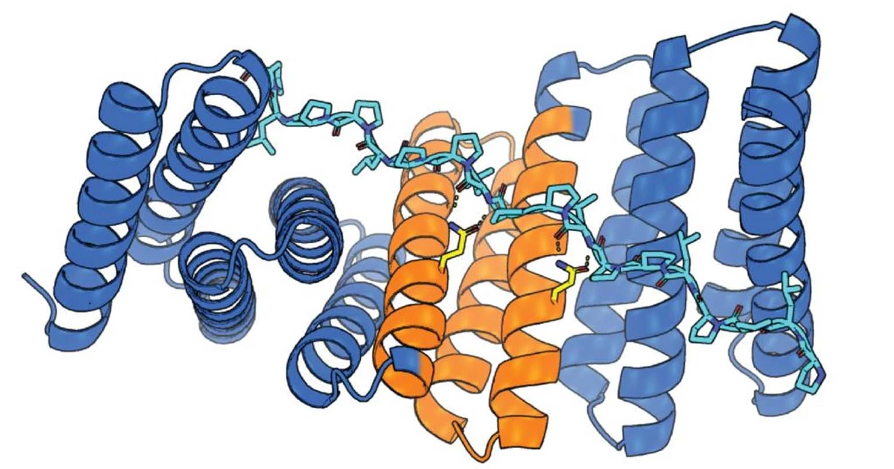

# Deep Learning for peptides

⚠️ Note: My PhD research keeps me very busy, so this repository may not be updated frequently. For the latest domain-specific updates, please follow our WeChat Official Account (公众号) [MolAstra](https://mp.weixin.qq.com/s/PI_3E2NzZWBGy95hpFmhHQ) and Our [Paper Reading Project](https://paper.molastra.org).
This repo will be refreshed on an annual basis.

🔬 **Comprehensive List of Research Papers on Peptides and Deep Learning**

[](https://awesome.re) [](https://github.com/zhaisilong/awesome-peptide/stargazers)

🤖 With help from Codex agents, this repository is now partially automated: paper metadata lives in CSV files, paper-read entries are enriched from Crossref/arXiv, and README generation plus validation are reproducible.

🔗 Link directly to <a href="#contents">Contents</a>, <a href="#citations">Citations</a>

✅ **What sets us apart from similar resources:**

1. Versatile Tags: Organize and filter papers easily.
2. Easy Navigation: Internal links for quick jumps between sections and papers.
3. Expert Insights: Links to expert reviews and analysis.
4. Tag System: Quickly catch the paper features
5. CSV Downloads: [curated papers](data/paper.csv) and [paper-read papers](data/paper-read.csv).
6. Automation: Use [Liquid](https://liquid.readthedocs.io/en/latest/) templates to generate Markdown from `CSV`, making it easy to build your own paper repository. >>> [[Details](CONTRIBUTING.md)]

📅 _Papers last six month, updated on 2026-06-16:_

**Structure, Interactions, and Assembly of Membrane-Active Antimicrobial Polypeptides**<br>
Tzong-Hsien Lee, Patrick Charchar, Marc-Antoine Sani, Dang-Huy Le, Tu C. Le, Irene Yarovsky, Frances Separovic and Marie-Isabel Aguilar<br>
[**2026**-5-21] >> [Chem. Rev.](https://doi.org/10.1021/acs.chemrev.5c00994) • high • [paper-read](https://paper.molastra.org/reviews/2026/amp_chemical_reviews_A/) • AMPs

**PEP-EDIT: a web server for the 3D generation and interactive editing of complex peptides**<br>
Nicolas Chevrollier, Alexis Dougha, Celine Ye, Dirk Stratmann, Gautier Moroy, Julien Rey, Samuel Murail and Pierre Tufféry<br>
[**2026**-5-14] >> [Nucleic Acids Research](https://doi.org/10.1093/nar/gkag455) • [paper-read](https://paper.molastra.org/webserver/2026/PEP_EDIT/)

<details>
<summary>🔎 Abstract</summary>
<p>In recent years, the development of peptide drugs has seen significant growth. These molecules often go beyond simple linear chains composed of the standard 20 amino acids. Peptide drugs frequently incorporate non-standard amino acids, non-amino components, and can exhibit mono- or multicyclic structures, branching, and other complex topologies. Consequently, there is a growing need for accessible tools that allow researchers to easily generate and modify 1D, 2D, and 3D representations of these complex peptides, serving as a starting point for further optimization. PEP-EDIT was created to meet this need. It offers a user-friendly, interactive web interface for generating complex peptide representations from 1D BILN (Boehringer Ingelheim Line Notation) sequences, using a customizable monomer library. Building on the pyPept library, PEP-EDIT enhances its functionality with options such as pH-dependent protonation and simplified specification of conformational constraints. The platform leverages interactive 2D and 3D visualizations to guide peptide design, offers intuitive management of monomers and 3D models, and includes collaborative and interactive visualization tools. PEP-EDIT is available at https://pep-edit.rpbs.univ-paris-diderot.fr. This website is free and open to all users and there is no login requirement.</p>
</details>

**Reusability report: Meta-learning for antigen-specific T cell receptor binder identification**<br>
Fei He, Xianyu Wang and Dong Xu<br>
[**2026**-5-6] >> [Nat Mach Intell](https://doi.org/10.1038/s42256-026-01236-6) • [GitHub](https://github.com/coffee19850519/PanPep_Reusability) • [paper-read](https://paper.molastra.org/journal/2026/202605/PanPep/)

**AI-Designed Peptides as Tools for Biochemistry**<br>
Lauren Hong, Sophia Vincoff and Pranam Chatterjee<br>
[**2026**-4-10] >> [Biochemistry](https://doi.org/10.1021/acs.biochem.6c00138) • [paper-read](https://paper.molastra.org/journal/2026/202604/AI-Designed Peptides/) • AI

**The evolution of computation-driven paradigms in targeted peptide drug design: From predictive modeling to generative AI and clinical translation**<br>
Wenjing Hu, Yuan Sun, Ting Li, Mark Williamson, Xiaoying Hu and Maolin Wang<br>
[**2026**-4-1] >> [The Innovation Drug Discovery](https://doi.org/10.59717/j.xinn-drugdisc.2026.100009) • high • [paper-read](https://paper.molastra.org/reviews/2026/AI_Peptide_Design/) • Diffusion/MD/AI

<details>
<summary>🔎 Abstract</summary>
<p>Targeted peptide therapeutics offer a potent solution for undruggable intracellular targets, and this review summarizes computation-driven peptide drug design from predictive modeling to generative AI and clinical translation.</p>
</details>

**Amino acid composition drives aggregation during peptide synthesis**<br>
Bálint Tamás, Marvin Alberts, Teodoro Laino and Nina Hartrampf<br>
[**2026**-3-20] >> [Nat. Chem.](https://doi.org/10.1038/s41557-026-02090-0) • [GitHub](https://github.com/rxn4chemistry/AI4Aggregation) • [paper-read](https://paper.molastra.org/journal/2026/202603/aa_composition_peptide_nc/)

<details>
<summary>🔎 Abstract</summary>
<p>Peptide aggregation is a long-standing challenge in chemical peptide synthesis, limiting its efficiency and reliability. Although data-driven methods have enhanced our understanding of many sequence-based phenomena, no comprehensive approach addresses so-called non-random difficult couplings (generally linked to aggregation) during solid-phase peptide synthesis. Here we leverage existing peptide synthesis datasets, supplemented with further experimental data, to build a predictive model that deciphers the role of individual amino acids in triggering aggregation. We first identified and experimentally validated composition-dependent aggregation as a stronger predictor than sequence-based patterns. This insight enabled the development of a composition vector representation, allowing insights into the aggregation propensities of individual amino acids. Applying an ensemble of trained models, we predicted the aggregation properties of peptides and recommended the optimized use of aggregation-reducing tools. By elucidating each individual amino acid’s influence, this method holds the potential to accelerate synthesis optimization through existing data, offering a robust framework for understanding and controlling peptide aggregation.</p>
</details>

**Peptide-protein docking: from physics-based models to generative intelligence**<br>
Kai Ling, Shu Li, Zicong Zhang, Woong-Hee Shin and Daisuke Kihara<br>
[**2026**-1-1] >> [Chem. Commun.](https://doi.org/10.1039/d6cc00583g) • high • [paper-read](https://paper.molastra.org/reviews/2026/pep_dock_review_cc/) • Docking/Diffusion

<details>
<summary>🔎 Abstract</summary>
<p>We review the evolution of peptide–protein docking methods from traditional physics-based approaches to modern AlphaFold-inspired and diffusion-based frameworks. Their impact, remaining limitations, and open challenges are discussed.</p>
</details>

**Automated Rapid Synthesis of High-Purity Head-to-Tail Cyclic Peptides via a Diaminonicotinic Acid Scaffold**<br>
Feng Wan, Chengrui Hu, Pei Xie, Xingxing Yang, Xin He, Yourong Pan, Zuozhou Ning and Chengxi Li<br>
[**2025**-12-22] >> [J. Am. Chem. Soc.](https://doi.org/10.1021/jacs.5c16902) • [paper-read](https://paper.molastra.org/journal/2025/202512/CycloBot/) • Cyclic

📌 _Papers pinned:_

**BindCraft: one-shot design of functional protein binders**<br>
Martin Pacesa, Lennart Nickel, ..., Sergey Ovchinnikov, Bruno E. Correia<br>
[**2025**-8-27] >> [Nature](https://doi.org/10.1038/s41586-025-09429-6) • high • [GitHub](https://github.com/martinpacesa/BindCraft) • [公众号](https://mp.weixin.qq.com/s/U4akBYhlFbOhHfJl2R2blg) / [paper-read](https://paper.molastra.org/journal/2025/202508/bindcraft/)

<details>
<summary>🔎 Abstract</summary>
<p>BindCraft is an open-source, automated pipeline for <em>de novo</em> protein binder design, achieving experimental success rates of 10-100%. Using deep learning models like AlphaFold2, BindCraft generates high-affinity binders without the need for high-throughput screening or prior knowledge of binding sites. It has been successfully applied to challenging targets, including cell-surface receptors, allergens, and CRISPR-Cas9. In one example, the binders reduced IgE binding to birch allergens in patient samples, showcasing its potential in therapeutics, diagnostics, and biotechnology.</p>
</details>

**PepINVENT: Generative peptide design beyond the natural amino acids**<br>
Gökçe Geylan, Jon Paul Janet, Alessandro Tibo, Jiazhen He, Atanas Patronov, Mikhail Kabeshov, Florian David, Werngard Czechtizky, Ola Engkvist, Leonardo De Maria<br>
[**2025**-1-1] >> [Chem. Sci.](https://doi.org/10.1039/d4sc07642g) • [GitHub](https://github.com/MolecularAI/PepINVENT/) • [paper-read](https://paper.molastra.org/journal/2025/202509/pepinvent/) • RL/[Molecular AI](https://github.com/molecularai)/AstraZeneca

**Hotspot-Driven Peptide Design via Multi-Fragment Autoregressive Extension**<br>
Jiahan Li, Tong Chen, Shitong Luo, Chaoran Cheng, Jiaqi Guan, Ruihan Guo, Sheng Wang, Ge Liu, Jian Peng, Jianzhu Ma<br>
[**2024**-11-26] >> ICML/[arXiv](https://doi.org/10.48550/arXiv.2411.18463) • [Jianzhu Ma](https://scholar.google.com/citations?user=AATzYuAAAAAJ)/Flow

**Accurate de Novo Design of High-Affinity Protein Binding Macrocycles Using Deep Learning**<br>
Stephen Rettie, ..., Gaurav Bhardwaj<br>
[**2024**-11-18] >> [bioRxiv](https://doi.org/10.1101/2024.11.18.622547) • high • [RFdiffusion](https://github.com/RosettaCommons/RFdiffusion)/[David Baker](https://scholar.google.com/citations?hl=en&user=UKqIqRsAAAAJ)/[Gaurav Bhardwaj](https://scholar.google.com/citations?user=AJSn9j0AAAAJ)/Cyclic

**Discovery of antimicrobial peptides with notable antibacterial potency by an LLM-based foundation model**<br>
Jike Wang, Jianwen Feng, Yu Kang, Peichen Pan, Jingxuan Ge, Yan Wang, Mingyang Wang<br>
[**2024**-10-10] >> [Science Advances](https://doi.org/10.1126/sciadv.ads8932) • high • [GitHub](https://github.com/jkwang93/AMP-designer) • [公众号](https://mp.weixin.qq.com/s/BWuRo2A3ehLlhi2Eq2-Qhw) • AMPs/[Tingjun Hou](https://scholar.google.com/citations?hl=en&user=vHW2kqUAAAAJ)/Diffusion/[Chang-Yu Hsieh](https://scholar.google.com/citations?user=K-AjhSgAAAAJ)

**Target-Specific De Novo Peptide Binder Design with DiffPepBuilder**<br>
Fanhao Wang, Yuzhe Wang, Laiyi Feng, Changsheng Zhang, and Luhua Lai<br>
[**2024**-9-4] >> [JCIM](https://doi.org/10.1021/acs.jcim.4c00975) • high • [GitHub](https://github.com/YuzheWangPKU/DiffPepBuilder) • Diffusion/[Luhua Lai](https://scholar.google.com/citations?hl=en&user=8NJFCTYAAAAJ)/[ColabDesign](https://github.com/sokrypton/ColabDesign)/[ProteinMPNN](https://www.science.org/doi/10.1126/science.add2187)/MD

<details>
<summary>🔎 Abstract</summary>
<p>Despite the exciting progress in target-specific de novo protein binder design, peptide binder design remains challenging due to the flexibility of peptide structures and the scarcity of protein-peptide complex structure data. In this study, we curated a large synthetic data set, referred to as PepPC-F, from the abundant protein−protein interface data and developed DiffPepBuilder, a de novo target-specific peptide binder generation method that utilizes an SE(3)-equivariant diffusion model trained on PepPC-F to codesign peptide sequences and structures. DiffPepBuilder also introduces disulfide bonds to stabilize the generated peptide structures. We tested DiffPepBuilder on 30 experimentally verified strong peptide binders with available protein−peptide complex structures. DiffPepBuilder was able to effectively recall the native structures and sequences of the peptide ligands and to generate novel peptide binders with improved binding free energy. We subsequently conducted de novo generation case studies on three targets. In both the regeneration test and case studies, DiffPepBuilder outperformed AfDesign and RFdiffusion coupled with ProteinMPNN, in terms of sequence and structure recall, interface quality, and structural diversity. Molecular dynamics simulations confirmed that the introduction of disulfide bonds enhanced the structural rigidity and binding performance of the generated peptides. As a general peptide binder de novo design tool, DiffPepBuilder can be used to design peptide binders for given protein targets with three-dimensional and binding site information.</p>
</details>

**CycPeptMP: Enhancing Membrane Permeability Prediction of Cyclic Peptides with Multi-Level Molecular Features and Data Augmentation**<br>
Jianan Li, Keisuke Yanagisawa, and Yutaka Akiyama<br>
[**2024**-9-1] >> [BIB](https://doi.org/10.1093/bib/bbae417) • high • [CycPeptMPDB](http://cycpeptmpdb.com/) • [GitHub](https://github.com/akiyamalab/cycpeptmp) • Cyclic/[Akiyama Yutaka](https://scholar.google.com/citations?hl=en&user=eHAafMgAAAAJ)

**Direct conformational sampling from peptide energy landscapes through hypernetwork-conditioned diffusion**<br>
Osama Abdin & Philip M. Kim<br>
[**2024**-6-27] >> [NMI](https://doi.org/10.1038/s42256-024-00860-4) • high • [data](http://pepflow.ccbr.proteinsolver.org) • [PepFlow](https://gitlab.com/oabdin/pepflow) • Cyclic/MD/Diffusion

**Full-Atom Peptide Design Based on Multi-Modal Flow Matching**<br>
Jiahan Li, Chaoran Cheng, Zuofan Wu, Ruihan Guo, Shitong Luo, Zhizhou Ren, Jian Peng, and Jianzhu Ma<br>
[**2024**-6-2] >> [arXiv](https://doi.org/10.48550/arXiv.2406.00735) • high • [GitHub](https://github.com/Ced3-han/PepFlowww) • [Jianzhu Ma](https://scholar.google.com/citations?user=AATzYuAAAAAJ)/Flow

**Full-Atom Peptide Design with Geometric Latent Diffusion**<br>
Xiangzhe Kong, Yinjun Jia, Wenbing Huang, Yang Liu<br>
[**2024**-2-21] >> NeurIPS/[Arxive](https://doi.org/10.48550/arXiv.2402.13555) • [code](https://github.com/THUNLP-MT/PepGLAD) • Full-Atom/Diffusion

**PepMLM: Target Sequence-Conditioned Generation of Peptide Binders via Masked Language Modeling**<br>
Tianlai Chen, Sarah Pertsemlidis, and Pranam Chatterjee<br>
[**2023**-10-5] >> [ICLR](https://doi.org/10.48550/arXiv.2310.03842) • high • [Pranam Chatterjee](https://scholar.google.co.uk/citations?user=XExgv9YAAAAJ)/MLM

**Improving de novo protein binder design with deep learning**<br>
Nathaniel R. Bennett, Brian Coventry, ..., David Baker<br>
[**2023**-5-6] >> [NC](https://doi.org/10.1038/s41467-023-38328-5) • high • [GitHub](https://github.com/nrbennet/dl_binder_design) • [RosettaCommons](https://www.rosettacommons.org)/[ProteinMPNN](https://www.science.org/doi/10.1126/science.add2187)

**Denovo design of modular peptide-binding proteins by superhelical matching**<br>
Kejia Wu, Hua Bai, ..., Emmanuel Derivery, Daniel Adriano Silva, David Baker<br>
[**2023**-3-5] >> [Nature](https://doi.org/10.1038/s41586-023-05909-9) • high • [data](https://files.ipd.uw.edu/pub/2023_modular_peptide_binding_proteins/all_data_modular_peptide_binding_proteins.tar.gz) • [GitHub](https://github.com/tjs23/prot_pep_scan) • [David Baker](https://scholar.google.com/citations?hl=en&user=UKqIqRsAAAAJ)

<details>
<summary>🔎 Abstract</summary>
<p>General approaches for designing sequence-specific peptide-binding proteins would have wide utility in proteomics and synthetic biology. However, designing peptide-binding proteins is challenging, as most peptides do not have defined structures in isolation, and hydrogen bonds must be made to the buried polar groups in the peptide backbone1–3. Here, inspired by natural and re-engineered proteinpeptide systems4–11, we set out to design proteins made out of repeating units that bind peptides with repeating sequences, with a one-to-one correspondence between the repeat units of the protein and those of the peptide. We use geometric hashing to identify protein backbones and peptide-docking arrangements that are compatible with bidentate hydrogen bonds between the side chains of the protein and the peptide backbone12. The remainder of the protein sequence is then optimized for folding and peptide binding. We design repeat proteins to bind to six different tripeptide-repeat sequences in polyproline II conformations. The proteins are hyperstable and bind to four to six tandem repeats of their tripeptide targets with nanomolar to picomolar affinities in vitro and in living cells. Crystal structures reveal repeating interactions between protein and peptide interactions as designed, including ladders of hydrogen bonds from protein side chains to peptide backbones. By redesigning the binding interfaces of individual repeat units, specificity can be achieved for non-repeating peptide sequences and for disordered regions of native proteins.</p>
</details>

**Target structure based computational design of cyclic peptides**<br>
WANG Fanhao, LAI Luhua, ZHANG Changsheng<br>
[**2023**-1-1] >> [SynbioJ](https://doi.org/10.12211/2096-8280.2023-006) • high • [pdf](./resource/10.12211/2096-8280.2023-006.pdf) • Cyclic/MD/[Luhua Lai](https://scholar.google.com/citations?hl=en&user=8NJFCTYAAAAJ)

**Design of Protein Segments and Peptides for Binding to Protein Targets**<br>
Suchetana Gupta, Noora Azadvari, and Parisa Hosseinzadeh<br>
[**2022**-1-1] >> [BioDesign Research](https://doi.org/10.34133/2022/9783197) • high

**Anchor extension: a structure-guided approach to  design cyclic peptides targeting enzyme active sites**<br>
Parisa Hosseinzadeh, ..., David Baker<br>
[**2021**-7-7] >> [NC](https://doi.org/10.1038/s41467-021-23609-8) • [Peptide_HDACBinders](https://github.com/ParisaH-Lab/publications.git) • [Tencent](https://cloud.tencent.com/developer/article/1880256) • Cyclic/[David Baker](https://scholar.google.com/citations?hl=en&user=UKqIqRsAAAAJ)/MD/Crystal

**Elucidating Solution Structures of Cyclic Peptides Using Molecular Dynamics Simulations**<br>
Jovan Damjanovic, Jiayuan Miao, He Huang, Yu-Shan Lin<br>
[**2021**-1-11] >> [Chemical Reviews](https://doi.org/10.1021/acs.chemrev.0c01087) • high • Cyclic/MD

**Strategies for Fine-Tuning the Conformations of Cyclic Peptides**<br>
Rasha Jwad, Daniel Weissberger, and Luke Hunter<br>
[**2020**-8-5] >> [Chem. Rev.](https://doi.org/10.1021/acs.chemrev.0c00013) • high • Cyclic

---

<p align="center">
  <a href="https://doi.org/10.1038/s41586-023-05909-9">
  
  </a>
</p>

<p id="contents" align='center'>
  <strong><a href='#0-benchmarks-and-datasets'>0) Benchmarks and Datasets</a></strong>
  <br>
  <a href="#01-benchmarks">Benchmarks</a> •
  <a href="#02-datasets">Datasets</a> •
  <a href="#03-similar-list">Similar List</a> •
  <a href="#04-tools">Tools</a>
  <br>
  <strong><a href='#1-reviews'>1) Reviews</a></strong>
  <br><a href='#11-design-&-generation'>Design & Generation</a> •
  <a href='#12-property-&-activity'>Property & Activity</a> •
  <a href='#13-structure-&-interaction'>Structure & Interaction</a> •
  <a href='#14-therapeutics-&-applications'>Therapeutics & Applications</a>
  <br>
  <strong><a href='#2-representation-&-data'>2) Representation & Data</a></strong>
  <br><a href='#21-structure-&-graph'>Structure & Graph</a>
  <br>
  <strong><a href='#3-property-&-activity-prediction'>3) Property & Activity Prediction</a></strong>
  <br><a href='#31-bioactivity-&-function'>Bioactivity & Function</a> •
  <a href='#32-interaction-&-binding'>Interaction & Binding</a> •
  <a href='#33-permeability-&-developability'>Permeability & Developability</a>
  <br>
  <strong><a href='#4-structure-&-interaction-modeling'>4) Structure & Interaction Modeling</a></strong>
  <br><a href='#41-docking-&-simulation'>Docking & Simulation</a> •
  <a href='#42-peptide-conformation'>Peptide Conformation</a> •
  <a href='#43-peptide-protein-complexes'>Peptide-Protein Complexes</a>
  <br>
  <strong><a href='#5-peptide-design-&-generation'>5) Peptide Design & Generation</a></strong>
  <br><a href='#51-classical-&-fragment-based'>Classical & Fragment-Based</a> •
  <a href='#52-diffusion-&-flow'>Diffusion & Flow</a> •
  <a href='#53-reinforcement-learning'>Reinforcement Learning</a> •
  <a href='#54-sequence-based-design'>Sequence-Based Design</a> •
  <a href='#55-structure-based-design'>Structure-Based Design</a>
  <br>
  <strong><a href='#6-applications-&-tools'>6) Applications & Tools</a></strong>
  <br><a href='#61-chemical-biology-&-modalities'>Chemical Biology & Modalities</a> •
  <a href='#62-protein-binders'>Protein Binders</a> •
  <a href='#63-screening-&-discovery'>Screening & Discovery</a> •
  <a href='#64-software-&-webservers'>Software & Webservers</a> •
  <a href='#65-therapeutics-&-translation'>Therapeutics & Translation</a>
  <br>
</p>

---

## 0. Benchmarks and Datasets

### 0.1 Benchmarks

#### 0.1.1 Sequence Benchmarks

#### 0.1.2 Structure Benchmarks

**Advancements in Nanobody Epitope Prediction: A Comparative Study of AlphaFold2Multimer vs AlphaFold3**  
Eshak, Floriane, and Anne Goupil-Lamy
[**2025**-2-24] >> [JCIM](https://doi.org/10.1021/acs.jcim.4c01877)

**Predicting Protein−Peptide Interactions: Benchmarking Deep Learning Techniques and a Comparison with Focused Docking**  
Sudhanshu Shanker and Michel F. Sanner  
[**2024**-5-11] >> [JCIM](https://doi.org/10.1021/acs.jcim.3c00602) • [GitHub](https://github.com/sannerlab/benchmarking_2023) • Fold

**Comprehensive Evaluation of 10 Docking Programs on a Diverse Set of Protein−Cyclic Peptide Complexes**
Huifeng Zhao, Dejun Jiang, Chao Shen, Jintu Zhang, Xujun Zhang, Xiaorui Wang, Dou Nie, Tingjun Hou, and Yu Kang  
[**2024**-2-29] >> [JCIM](https://doi.org/10.1021/acs.jcim.3c01921) • [CPSet](https://github.com/huifengzhao/CPSet) • [Tingjun Hou](https://scholar.google.com/citations?hl=en&user=vHW2kqUAAAAJ)

**Benchmarking AlphaFold2 on peptide structure prediction**  
Eli Fritz McDonald, Taylor Jones, Lars Plate, Jens Meiler, Alican Gulsevin  
[**2024**-1-5] >> [Structure](https://doi.org/10.1016/j.str.2022.11.012) • [SI](https://doi.org/10.1016/j.str.2022.11.012) • [Weixin](https://mp.weixin.qq.com/s/9mpyZXITVC6RBbNQmjJLcg) • [AF](https://deepmind.google/technologies/alphafold/)

**Comprehensive Evaluation of Fourteen Docking Programs on Protein−Peptide Complexes**  
Gaoqi Weng, Junbo Gao, Zhe Wang, Ercheng Wang, Xueping Hu, Xiaojun Yao, Dongsheng Cao & Tingjun Hou  
[**2020**-3-23] >> [JCTC](https://doi.org/10.1021/acs.jctc.9b01208) • [pepset](http://cadd.zju.edu.cn/pepset/) • high • [Tingjun Hou](https://scholar.google.com/citations?hl=en&user=vHW2kqUAAAAJ)

**Highly Flexible Ligand Docking: Benchmarking of the DockThor Program on the LEADS-PEP Protein−Peptide Data Set**  
Karina B. Santos, Isabella A. Guedes, Ana L. M. Karl, and Laurent E. Dardenne  
[**2020**-1-10] >> [JCIM](https://doi.org/10.1021/acs.jcim.9b00905) • [DockerThor](https://www.dockthor.lncc.br) • MD

#### 0.1.3 Evaluations

### 0.2 Datasets

### 0.2.1 Public Datasets

> A list of suggested peptide datasets

| Datasets    | Description                                                                                                                                                                                                                                                         | Link                                  |
| ----------- | ------------------------------------------------------------------------------------------------------------------------------------------------------------------------------------------------------------------------------------------------------------------- | ------------------------------------- |
| CycPeptMPDB | CycPeptMPDB, the first web-accessible database of cyclic peptide membrane permeability.                                                                                                                                                                             | [CycPeptMPDB](http://cycpeptmpdb.com) |
| State of Peptides 2026 | Open reference dataset of 156 peptide and peptide-adjacent compounds with regulatory status, category, route, half-life, molecular weight, CAS, and PubChem/DrugBank/Wikidata cross-references (CSV/JSON, CC BY 4.0). | [State of Peptides 2026](https://peptahub.com/state-of-peptides-2026) |

#### 0.2.1 Sequence Datasets

**CycPeptMPDB: A Comprehensive Database of Membrane Permeability of Cyclic Peptides**  
Jianan Li, Keisuke Yanagisawa, Masatake Sugita, Takuya Fujie, Masahito Ohue & Yutaka Akiyama  
[**2023**-3-17] >> [JCIM](https://doi.org/10.1021/acs.jcim.2c01573) • [CycPeptMPDB](http://cycpeptmpdb.com) • [Akiyama Yutaka](https://scholar.google.com/citations?hl=en&user=eHAafMgAAAAJ)

#### 0.2.2 Structure Datasets

### 0.3 Similar List

> Some similar GitHub lists that include papers about peptide using deep learning

1. Similar List 1
2. Similar List 2

### 0.4 Guides

> Guides/Tutorials for beginners on GitHub

1. Tutorials 1
2. Tutorials 2

### 0.5 Tools

1. HELM
   1. [HELM Online](http://webeditor.openhelm.org/hwe/examples/App.htm)
   2. [HELM Doc](https://pistoiaalliance.atlassian.net/wiki/spaces/PUB/pages/35028994/HELM+Web-editor)
   3. [HELM GitHub HELMWebEditor](https://github.com/PistoiaHELM/HELMWebEditor)
2. PDB
   1. [pdb-tools](http://www.bonvinlab.org/pdb-tools/)
   2. [BioPython](https://biopython.org)
   3. [BioPandas](https://biopandas.github.io/biopandas/)
   4. [RDKit](https://www.rdkit.org)
3. Interaction
   1. [Protein-Ligand Interaction Profiler, PLIP](https://plip-tool.biotec.tu-dresden.de/plip-web/plip/index)
4. Property Calculators
   1. [Peptide Molecular Weight Calculator](https://peptidecalculatorpro.org/peptide-molecular-weight-calculator/): average MW, monoisotopic mass, formula and m/z from a sequence, with acetyl, amide and disulfide options
   2. [Peptide Net Charge Calculator](https://peptidecalculatorpro.org/peptide-net-charge-calculator/): net charge at any pH, isoelectric point (pI) and GRAVY from a sequence (EMBOSS pKa values), with N- and C-terminal modification options

## 1. Reviews

### 1.1 Design & Generation

**AI-Designed Peptides as Tools for Biochemistry**<br>
Lauren Hong, Sophia Vincoff and Pranam Chatterjee<br>
[**2026**-4-10] >> [Biochemistry](https://doi.org/10.1021/acs.biochem.6c00138) • [paper-read](https://paper.molastra.org/journal/2026/202604/AI-Designed Peptides/) • AI

**The evolution of computation-driven paradigms in targeted peptide drug design: From predictive modeling to generative AI and clinical translation**<br>
Wenjing Hu, Yuan Sun, Ting Li, Mark Williamson, Xiaoying Hu and Maolin Wang<br>
[**2026**-4-1] >> [The Innovation Drug Discovery](https://doi.org/10.59717/j.xinn-drugdisc.2026.100009) • high • [paper-read](https://paper.molastra.org/reviews/2026/AI_Peptide_Design/) • Diffusion/MD/AI

<details>
<summary>🔎 Abstract</summary>
<p>Targeted peptide therapeutics offer a potent solution for undruggable intracellular targets, and this review summarizes computation-driven peptide drug design from predictive modeling to generative AI and clinical translation.</p>
</details>

**AI-Driven Antimicrobial Peptide Discovery: Mining and Generation**<br>
Paulina Szymczak, Wojciech Zarzecki, Jiejing Wang, Yiqian Duan, Jun Wang, Luis Pedro Coelho, Cesar de la Fuente-Nunez and Ewa Szczurek<br>
[**2025**-6-3] >> [Acc. Chem. Res.](https://doi.org/10.1021/acs.accounts.0c00594) • high • [paper-read](https://paper.molastra.org/reviews/2025/amp-accounts/) • AMPs

**Artificial intelligence in peptide-based drug design**<br>
Zhai Silong, Tiantao Liu, Shaolong Lin, Dan Li, Huanxiang Liu, Xiaojun Yao and Tingjun Hou<br>
[**2025**-2-1] >> [Drug Discovery Today](https://doi.org/10.1016/j.drudis.2025.104300) • [GitHub](https://github.com/zhaisilong/awesome-peptide) • [Tingjun Hou](https://scholar.google.com/citations?hl=en&user=vHW2kqUAAAAJ)

**Unlocking novel therapies: cyclic peptide design for amyloidogenic targets through synergies of experiments, simulations, and machine learning**<br>
Daria de Raffele and Ioana M. Ilie<br>
[**2023**-11-7] >> [Chem. Commun.](https://doi.org/10.1039/D3CC04630C) • Cyclic/MD

**Target structure based computational design of cyclic peptides**<br>
WANG Fanhao, LAI Luhua, ZHANG Changsheng<br>
[**2023**-1-1] >> [SynbioJ](https://doi.org/10.12211/2096-8280.2023-006) • high • [pdf](./resource/10.12211/2096-8280.2023-006.pdf) • Cyclic/MD/[Luhua Lai](https://scholar.google.com/citations?hl=en&user=8NJFCTYAAAAJ)

**Design of Protein Segments and Peptides for Binding to Protein Targets**<br>
Suchetana Gupta, Noora Azadvari, and Parisa Hosseinzadeh<br>
[**2022**-1-1] >> [BioDesign Research](https://doi.org/10.34133/2022/9783197) • high


### 1.2 Property & Activity

**Structure, Interactions, and Assembly of Membrane-Active Antimicrobial Polypeptides**<br>
Tzong-Hsien Lee, Patrick Charchar, Marc-Antoine Sani, Dang-Huy Le, Tu C. Le, Irene Yarovsky, Frances Separovic and Marie-Isabel Aguilar<br>
[**2026**-5-21] >> [Chem. Rev.](https://doi.org/10.1021/acs.chemrev.5c00994) • high • [paper-read](https://paper.molastra.org/reviews/2026/amp_chemical_reviews_A/) • AMPs

**Machine learning for antimicrobial peptide identification and design**<br>
Fangping Wan, Felix Wong, James J. Collins & Cesar de la Fuente-Nunez<br>
[**2024**-2-26] >> [Nat Rev Bioeng](https://doi.org/10.1038/s44222-024-00152-x) • AMPs


### 1.3 Structure & Interaction

**Peptide-protein docking: from physics-based models to generative intelligence**<br>
Kai Ling, Shu Li, Zicong Zhang, Woong-Hee Shin and Daisuke Kihara<br>
[**2026**-1-1] >> [Chem. Commun.](https://doi.org/10.1039/d6cc00583g) • high • [paper-read](https://paper.molastra.org/reviews/2026/pep_dock_review_cc/) • Docking/Diffusion

<details>
<summary>🔎 Abstract</summary>
<p>We review the evolution of peptide–protein docking methods from traditional physics-based approaches to modern AlphaFold-inspired and diffusion-based frameworks. Their impact, remaining limitations, and open challenges are discussed.</p>
</details>

**A comprehensive review of protein-centric predictors for biomolecular interactions: from proteins to nucleic acids and beyond**<br>
Pengzhen Jia, Fuhao Zhang, Chaojin Wu and Min Li<br>
[**2024**-3-31] >> [BIB](https://doi.org/10.1093/bib/bbae162)

**Modelling peptide–protein complexes: docking, simulations and machine learning**<br>
Arup Mondal, Liwei Chang and Alberto Perez<br>
[**2022**-8-26] >> [QRB Discovery](https://doi.org/10.1017/qrd.2022.14) • Docking/MD

**Peptide-based inhibitors of protein-protein interactions: biophysical, structural and cellular consequences of introducing a constraint**<br>
Hongshuang Wang, Robert S. Dawber, Peiyu Zhang, Martin Walko, Andrew J. Wilson and Xiaohui Wang<br>
[**2021**-1-1] >> [Chem. Sci.](https://doi.org/10.1039/d1sc00165e) • [paper-read](https://paper.molastra.org/reviews/2026/pep-based-inhibitors-ppi-cs/) • Cyclic

<details>
<summary>🔎 Abstract</summary>
<p>This review summarizes the influence of inserting constraints on biophysical, conformational, structural and cellular behaviour for peptides targeting α-helix mediated protein–protein interactions.</p>
</details>

**Strategies for Fine-Tuning the Conformations of Cyclic Peptides**<br>
Rasha Jwad, Daniel Weissberger, and Luke Hunter<br>
[**2020**-8-5] >> [Chem. Rev.](https://doi.org/10.1021/acs.chemrev.0c00013) • high • Cyclic


### 1.4 Therapeutics & Applications

**Recent Advances in Peptide Linkers of Antibody-Drug Conjugates**<br>
Lu Yang, Jiahui Ma, Ben Liu, Yangbing Li, Yaping Ma, Hao Chen and Zhijian Han<br>
[**2025**-9-2] >> [J. Med. Chem.](https://doi.org/10.1021/acs.jmedchem.5c01500) • [paper-read](https://paper.molastra.org/reviews/2025/ADC-pep-link/)

**Recent Advances in Augmenting the Therapeutic Efficacy of Peptide-Drug Conjugates**<br>
Jiahui Ma, Xuedan Wang, Yonghua Hu, Jianping Ma, Yaping Ma, Hao Chen and Zhijian Han<br>
[**2025**-4-23] >> [J. Med. Chem.](https://doi.org/10.1021/acs.jmedchem.5c00007) • [paper-read](https://paper.molastra.org/reviews/2025/jmc-pdc/)


## 2. Representation & Data

### 2.1 Structure & Graph

**Propedia v2.3: A novel  representation approach for the  peptide-protein interaction  database using graph-based  structural signatures**<br>
Pedro Martins, Diego Mariano, Frederico Chaves Carvalho, Luana Luiza Bastos, Lucas Moraes, Vivian Paixão and Raquel Cardoso de Melo-Minardi<br>
[**2023**-2-16] >> [Front. Bioinform.](https://doi.org/10.3389/fbinf.2023.1103103) • [SI](https://www.frontiersin.org/journals/bioinformatics/articles/10.3389/fbinf.2023.1103103/full#SM1) • [propedia](https://github.com/LBS-UFMG/propedia) • Graph


## 3. Property & Activity Prediction

### 3.1 Bioactivity & Function

**Deep learning reveals antibiotics in the archaeal proteome**<br>
Marcelo D. T. Torres, Fangping Wan and Cesar de la Fuente-Nunez<br>
[**2025**-8-12] >> [Nat Microbiol](https://doi.org/10.1038/s41564-025-02061-0) • high • [GitLab](https://gitlab.com/machine-biologygroup-public/apex-pathogen) • [paper-read](https://paper.molastra.org/journal/2025/202509/apex/) • AMPs

<details>
<summary>🔎 Abstract</summary>
<p>Antimicrobial resistance is one of the greatest threats facing humanity, making the need for new antibiotics more critical than ever. While most antibiotics originate from bacteria and fungi, archaea offer a largely untapped reservoir for antibiotic discovery. In this study, we leveraged deep learning to systematically explore the archaeome, uncovering promising candidates for combating antimicrobial resistance. By mining 233 archaeal proteomes, we identified 12,623 molecules with potential antimicrobial activity. These peptide compounds, termed archaeasins, have unique compositional features that differentiate them from traditional antimicrobial peptides, including a distinct amino acid profile. We synthesized 80 archaeasins, 93% of which showed antimicrobial activity in vitro against Acinetobacter baumannii , Escherichia coli , Klebsiella pneumoniae , Pseudomonas aeruginosa , Staphylococcus aureus and Enterococcus spp. Notably, in vivo validation identified archaeasin-73 as a lead candidate, significantly reducing A. baumannii loads in mouse infection models, with effectiveness comparable to that of established antibiotics such as polymyxin B. Our findings highlight the potential of archaea as a resource for developing next-generation antibiotics.</p>
</details>

**pLM4CPPs: Protein Language Model-Based Predictor for Cell Penetrating Peptides**<br>
Nandan Kumar, Zhenjiao Du and Yonghui Li<br>
[**2025**-1-29] >> [JCIM](https://doi.org/10.1021/acs.jcim.4c01338) • PLM


### 3.2 Interaction & Binding

**Reusability report: Meta-learning for antigen-specific T cell receptor binder identification**<br>
Fei He, Xianyu Wang and Dong Xu<br>
[**2026**-5-6] >> [Nat Mach Intell](https://doi.org/10.1038/s42256-026-01236-6) • [GitHub](https://github.com/coffee19850519/PanPep_Reusability) • [paper-read](https://paper.molastra.org/journal/2026/202605/PanPep/)

**An interaction-derived graph learning framework for scoring protein-peptide complexes**<br>
Huanyu Tao, Xiaoyu Wang and Sheng-You Huang<br>
[**2025**-10-23] >> [Nat Mach Intell](https://doi.org/10.1038/s42256-025-01136-1) • high • [paper-read](https://paper.molastra.org/journal/2025/202510/GraphPep/) • Graph


### 3.3 Permeability & Developability

**Peptide-Aware Chemical Language Model Successfully Predicts Membrane Diffusion of Cyclic Peptides**<br>
Aaron L. Feller, Claus O. Wilke<br>
[**2024**-11-21] >> [bioRxiv](https://doi.org/10.1101/2024.08.09.607221) • Cyclic

**Discovery of a Series of Macrocycles as Potent Inhibitors of Leishmania Infantum**<br>
Federico Riu, Larissa Alena Ruppitsch, Duc Duy Vo, Richard S. Hong, Mohit Tyagi, An Matheeussen, Sarah Hendrickx, Vasanthanathan Poongavanam, Guy Caljon, Ahmad Y. Sheikh, Peter Sjö, and Jan Kihlberg<br>
[**2024**-10-8] >> [J. Med. Chem.](https://doi.org/10.1021/acs.jmedchem.4c01370) • high • [公众号](https://mp.weixin.qq.com/s/jisVUSzJu4t9BD3JFVb_-A) • Cyclic

**Beware of extreme calculated lipophilicity when designing cyclic peptides**<br>
Vasanthanathan Poongavanam, Duc Duy Vo & Jan Kihlberg<br>
[**2024**-9-19] >> [Nat. Chem. Biol.](https://doi.org/10.1038/s41589-024-01715-0) • [SI](https://www.nature.com/articles/s41589-024-01715-0#MOESM1) • [公众号](https://mp.weixin.qq.com/s/B65rJB1i_xrP8fTfbQ3Taw) • Cyclic/cLogP

**CycPeptMP: Enhancing Membrane Permeability Prediction of Cyclic Peptides with Multi-Level Molecular Features and Data Augmentation**<br>
Jianan Li, Keisuke Yanagisawa, and Yutaka Akiyama<br>
[**2024**-9-1] >> [BIB](https://doi.org/10.1093/bib/bbae417) • high • [CycPeptMPDB](http://cycpeptmpdb.com/) • [GitHub](https://github.com/akiyamalab/cycpeptmp) • Cyclic/[Akiyama Yutaka](https://scholar.google.com/citations?hl=en&user=eHAafMgAAAAJ)


## 4. Structure & Interaction Modeling

### 4.1 Docking & Simulation

**Direct conformational sampling from peptide energy landscapes through hypernetwork-conditioned diffusion**<br>
Osama Abdin & Philip M. Kim<br>
[**2024**-6-27] >> [NMI](https://doi.org/10.1038/s42256-024-00860-4) • high • [data](http://pepflow.ccbr.proteinsolver.org) • [PepFlow](https://gitlab.com/oabdin/pepflow) • Cyclic/MD/Diffusion

**Elucidating Solution Structures of Cyclic Peptides Using Molecular Dynamics Simulations**<br>
Jovan Damjanovic, Jiayuan Miao, He Huang, Yu-Shan Lin<br>
[**2021**-1-11] >> [Chemical Reviews](https://doi.org/10.1021/acs.chemrev.0c01087) • high • Cyclic/MD


### 4.2 Peptide Conformation

**Predicting 3D Structures of Lasso Peptides**<br>
Xingyu Ouyang, Xinchun Ran, Han Xu, Yi-Lei Zhao, A. James Link, Zhongyue Yang<br>
[**2024**-10-14] >> [ChemRxiv](https://doi.org/10.26434/chemrxiv-2024-q3rn0-v2) • [LassoPred](https://github.com/ChemBioHTP/LassoPred)/[Web](https://lassopred.accre.vanderbilt.edu/) • Lasso/[AF](https://deepmind.google/technologies/alphafold/)/ESM/MD

<details>
<summary>🔎 Abstract</summary>
<p>这篇文章围绕 LassoPred 工具展开，解决了现有工具无法准确预测 套索肽（Lasso peptides, LaPs） 结构的挑战。套索肽以其 绳结状拓扑结构 和 异肽键 特性，使传统的结构预测工具（如 AlphaFold 和 ESMfold）难以处理。</p>
</details>

**Structure prediction of linear and cyclic peptides using  CABS-flex**<br>
Aleksandra Badaczewska-Dawid, Karol Wróblewski, Mateusz Kurcinski & Sebastian Kmiecik<br>
[**2023**-11-28] >> [BIB](https://doi.org/10.1093/bib/bbae003) • MD/Cyclic


### 4.3 Peptide-Protein Complexes

**Deep-learning-based prediction framework for protein-peptide interactions with structure generation pipeline**<br>
Jingxuan Ge, Dejun Jiang, ..., Chang-Yu Hsieh, Tingjun Hou<br>
[**2024**-6-19] >> [Cell Rep. Phys. Sci.](https://doi.org/10.1016/j.xcrp.2024.101980) • [zenodo](https://doi.org/10.5281/zenodo.8324920) • [ITN](https://github.com/gejingxuan/ITN) • [AF](https://deepmind.google/technologies/alphafold/)/[Tingjun Hou](https://scholar.google.com/citations?hl=en&user=vHW2kqUAAAAJ)

**HighFold: accurately predicting structures of cyclic  peptides and complexes with head-to-tail and disulfide  bridge constraints**<br>
Chenhao Zhang, Chengyun Zhang, Tianfeng Shang, Ning Zhu, Xinyi Wu, Hongliang Duan<br>
[**2024**-3-18] >> [BIB](https://doi.org/10.1093/bib/bbae215) • [HighFold](https://github.com/hongliangduan/HighFold) • [Hongliang Duan](https://www.mpu.edu.mo/esca/en/duanhongliang.php)/Cyclic/[AF](https://deepmind.google/technologies/alphafold/)

**Ranking Peptide Binders by Affinity with AlphaFold**<br>
Liwei Chang and Alberto Perez<br>
[**2022**-11-21] >> [Angew](https://doi.org/10.1002/anie.202213362) • [AF](https://deepmind.google/technologies/alphafold/)

**Harnessing protein folding neural networks for  peptide–protein docking**<br>
Tomer Tsaban, Julia K. Varga, Orly Avraham, Ziv Ben-Aharon, Alisa Khramushin &  Ora Schueler-Furman<br>
[**2021**-11-10] >> [NC](https://doi.org/10.1038/s41467-021-27838-9) • [GitHub](https://github.com/Furman-Lab/Peptide_docking_with_AF2_and_RosettAfold) • [AF](https://deepmind.google/technologies/alphafold/)/Docking


## 5. Peptide Design & Generation

### 5.1 Classical & Fragment-Based

**De Novo Design of Cyclic Peptide Binders Based on Fragment Docking and Assembling**<br>
Zhang, Changsheng, Fanhao Wang, Tiantian Zhang, Yang Yang, Liying Wang, Xiaoling Zhang and Luhua Lai<br>
[**2025**-4-14] >> [JCIM](https://doi.org/10.1021/acs.jcim.5c00088) • Cyclic/[Luhua Lai](https://scholar.google.com/citations?hl=en&user=8NJFCTYAAAAJ)/Docking

**Anchor extension: a structure-guided approach to  design cyclic peptides targeting enzyme active sites**<br>
Parisa Hosseinzadeh, ..., David Baker<br>
[**2021**-7-7] >> [NC](https://doi.org/10.1038/s41467-021-23609-8) • [Peptide_HDACBinders](https://github.com/ParisaH-Lab/publications.git) • [Tencent](https://cloud.tencent.com/developer/article/1880256) • Cyclic/[David Baker](https://scholar.google.com/citations?hl=en&user=UKqIqRsAAAAJ)/MD/Crystal


### 5.2 Diffusion & Flow

**Generative latent diffusion language modeling yields anti-infective synthetic peptides**<br>
Marcelo D.T. Torres, Leo Tianlai Chen, Fangping Wan, Pranam Chatterjee and Cesar de la Fuente-Nunez<br>
[**2025**-10-1] >> [Cell Biomaterials](https://doi.org/10.1016/j.celbio.2025.100183) • high • [GitHub](https://github.com/programmablebio/amp-diffusion) • [paper-read](https://paper.molastra.org/journal/2025/202510/AMP-Diffusion/) • AMPs/Diffusion

**UniMoMo: Unified generative modeling of 3D molecules for de novo binder design**<br>
Kong, Xiangzhe, Zishen Zhang, Ziting Zhang, Rui Jiao, Jianzhu Ma, Kai Liu, Wenbing Huang and Yang Liu<br>
[**2025**-3-25] >> [arXiv](https://doi.org/10.48550/arXiv.2503.19300) • Yang Liu/Diffusion/Full-Atom

**PepTune: De Novo Generation of Therapeutic Peptides with Multi-Objective-Guided Discrete Diffusion**<br>
Sophia Tang, Yinuo Zhang and Pranam Chatterjee<br>
[**2024**-12-23] >> [arXiv](https://doi.org/10.48550/arxiv.2412.17780) • [HuggingFace](https://huggingface.co/ChatterjeeLab/PepTune) • [paper-read](https://paper.molastra.org/conference/2025/PepTune/) • Diffusion/[Pranam Chatterjee](https://scholar.google.co.uk/citations?user=XExgv9YAAAAJ)

<details>
<summary>🔎 Abstract</summary>
<p>We present PepTune, a multi-objective discrete diffusion model for simultaneous generation and optimization of therapeutic peptide SMILES. Built on the Masked Discrete Language Model (MDLM) framework, PepTune ensures valid peptide structures with a novel bond-dependent masking schedule and invalid loss function. To guide the diffusion process, we introduce Monte Carlo Tree Guidance (MCTG), an inference-time multi-objective guidance algorithm that balances exploration and exploitation to iteratively refine Pareto-optimal sequences. MCTG integrates classifier-based rewards with search-tree expansion, overcoming gradient estimation challenges and data sparsity. Using PepTune, we generate diverse, chemically-modified peptides simultaneously optimized for multiple therapeutic properties, including target binding affinity, membrane permeability, solubility, hemolysis, and non-fouling for various disease-relevant targets. In total, our results demonstrate that MCTG for masked discrete diffusion is a powerful and modular approach for multi-objective sequence design in discrete state spaces.</p>
</details>

**Hotspot-Driven Peptide Design via Multi-Fragment Autoregressive Extension**<br>
Jiahan Li, Tong Chen, Shitong Luo, Chaoran Cheng, Jiaqi Guan, Ruihan Guo, Sheng Wang, Ge Liu, Jian Peng, Jianzhu Ma<br>
[**2024**-11-26] >> ICML/[arXiv](https://doi.org/10.48550/arXiv.2411.18463) • [Jianzhu Ma](https://scholar.google.com/citations?user=AATzYuAAAAAJ)/Flow

**Accurate de Novo Design of High-Affinity Protein Binding Macrocycles Using Deep Learning**<br>
Stephen Rettie, ..., Gaurav Bhardwaj<br>
[**2024**-11-18] >> [bioRxiv](https://doi.org/10.1101/2024.11.18.622547) • high • [RFdiffusion](https://github.com/RosettaCommons/RFdiffusion)/[David Baker](https://scholar.google.com/citations?hl=en&user=UKqIqRsAAAAJ)/[Gaurav Bhardwaj](https://scholar.google.com/citations?user=AJSn9j0AAAAJ)/Cyclic

**Discovery of antimicrobial peptides with notable antibacterial potency by an LLM-based foundation model**<br>
Jike Wang, Jianwen Feng, Yu Kang, Peichen Pan, Jingxuan Ge, Yan Wang, Mingyang Wang<br>
[**2024**-10-10] >> [Science Advances](https://doi.org/10.1126/sciadv.ads8932) • high • [GitHub](https://github.com/jkwang93/AMP-designer) • [公众号](https://mp.weixin.qq.com/s/BWuRo2A3ehLlhi2Eq2-Qhw) • AMPs/[Tingjun Hou](https://scholar.google.com/citations?hl=en&user=vHW2kqUAAAAJ)/Diffusion/[Chang-Yu Hsieh](https://scholar.google.com/citations?user=K-AjhSgAAAAJ)

**Target-Specific De Novo Peptide Binder Design with DiffPepBuilder**<br>
Fanhao Wang, Yuzhe Wang, Laiyi Feng, Changsheng Zhang, and Luhua Lai<br>
[**2024**-9-4] >> [JCIM](https://doi.org/10.1021/acs.jcim.4c00975) • high • [GitHub](https://github.com/YuzheWangPKU/DiffPepBuilder) • Diffusion/[Luhua Lai](https://scholar.google.com/citations?hl=en&user=8NJFCTYAAAAJ)/[ColabDesign](https://github.com/sokrypton/ColabDesign)/[ProteinMPNN](https://www.science.org/doi/10.1126/science.add2187)/MD

<details>
<summary>🔎 Abstract</summary>
<p>Despite the exciting progress in target-specific de novo protein binder design, peptide binder design remains challenging due to the flexibility of peptide structures and the scarcity of protein-peptide complex structure data. In this study, we curated a large synthetic data set, referred to as PepPC-F, from the abundant protein−protein interface data and developed DiffPepBuilder, a de novo target-specific peptide binder generation method that utilizes an SE(3)-equivariant diffusion model trained on PepPC-F to codesign peptide sequences and structures. DiffPepBuilder also introduces disulfide bonds to stabilize the generated peptide structures. We tested DiffPepBuilder on 30 experimentally verified strong peptide binders with available protein−peptide complex structures. DiffPepBuilder was able to effectively recall the native structures and sequences of the peptide ligands and to generate novel peptide binders with improved binding free energy. We subsequently conducted de novo generation case studies on three targets. In both the regeneration test and case studies, DiffPepBuilder outperformed AfDesign and RFdiffusion coupled with ProteinMPNN, in terms of sequence and structure recall, interface quality, and structural diversity. Molecular dynamics simulations confirmed that the introduction of disulfide bonds enhanced the structural rigidity and binding performance of the generated peptides. As a general peptide binder de novo design tool, DiffPepBuilder can be used to design peptide binders for given protein targets with three-dimensional and binding site information.</p>
</details>

**Full-Atom Peptide Design Based on Multi-Modal Flow Matching**<br>
Jiahan Li, Chaoran Cheng, Zuofan Wu, Ruihan Guo, Shitong Luo, Zhizhou Ren, Jian Peng, and Jianzhu Ma<br>
[**2024**-6-2] >> [arXiv](https://doi.org/10.48550/arXiv.2406.00735) • high • [GitHub](https://github.com/Ced3-han/PepFlowww) • [Jianzhu Ma](https://scholar.google.com/citations?user=AATzYuAAAAAJ)/Flow

**PPFlow: Target-Aware Peptide Design with Torsional Flow Matching**<br>
Lin, Haitao, Odin Zhang, Huifeng Zhao, Dejun Jiang, Lirong Wu, Zicheng Liu, Yufei Huang and Stan Z. Li<br>
[**2024**-3-8] >> [ICML](https://doi.org/10.48550/arXiv.2403.07583) • Stan Z. Li/Flow

**Full-Atom Peptide Design with Geometric Latent Diffusion**<br>
Xiangzhe Kong, Yinjun Jia, Wenbing Huang, Yang Liu<br>
[**2024**-2-21] >> NeurIPS/[Arxive](https://doi.org/10.48550/arXiv.2402.13555) • [code](https://github.com/THUNLP-MT/PepGLAD) • Full-Atom/Diffusion


### 5.3 Reinforcement Learning

**Painting Peptides With Antimicrobial Potency Through Deep Reinforcement Learning**<br>
Ruihan Dong, Qiushi Cao and Chen Song<br>
[**2025**-9-12] >> [Advanced Science](https://doi.org/10.1002/advs.202506332) • high • [GitHub](https://github.com/ComputBiophys/AMPainter) • [paper-read](https://paper.molastra.org/journal/2025/202509/AMPainter/) • AMPs/RL

<details>
<summary>🔎 Abstract</summary>
<p>In the post‐antibiotic era, antimicrobial peptides (AMPs) are considered ideal drug candidates because of their lower likelihood of inducing resistance. Computational models provide an efficient way to design novel AMPs. However, current optimization and generation approaches are tailored for specific application scenarios, which hinders the ease of use. To address this challenge, a novel AMP design model named AMPainter is proposed. Based on deep reinforcement learning, AMPainter integrates optimization and generation tasks in a unified framework. AMPainter is applied to three types of peptides, including known AMPs, signal peptides (SPs), and random sequences. AMPainter outperforms ten related models in enhancing the activity of known AMPs on the predicted antimicrobial potency and diversity. Several AMPs demonstrate a 128‐fold decrease in their actual minimal inhibitory concentrations (MICs). AMPainter evolves effective AMPs from membrane‐active SPs with an experimental success rate of 80%. In terms of generation, de novo designed AMP from an inactive random sequence achieves an average MIC of 2.88 µM against four bacteria. In vitro MICs of peptides along the virtual evolutionary path match the predicted scores. Therefore, AMPainter can significantly improve the antimicrobial potency of various peptides, expand the AMP sequence space, and discover novel antimicrobial agents.</p>
</details>

**PepThink-R1: An LLM-based Framework for Interpretable Cyclic Peptide Optimization**<br>
Ruheng Wang, Hang Zhang, Trieu Nguyen, Shasha Feng, Hao-Wei Pang, Xiang Yu, Li Xiao and Peter Zhiping Zhang<br>
[**2025**-8-20] >> [arXiv](https://doi.org/10.48550/arxiv.2508.14765) • [paper-read](https://paper.molastra.org/journal/2025/202509/PepThink-R1/) • RL/Cyclic

<details>
<summary>🔎 Abstract</summary>
<p>Designing therapeutic peptides with tailored properties is hindered by the vastness of sequence space, limited experimental data, and poor interpretability of current generative models. To address these challenges, we introduce PepThink-R1, a generative framework that integrates large language models (LLMs) with chain-of-thought (CoT) supervised fine-tuning and reinforcement learning (RL). Unlike prior approaches, PepThink-R1 explicitly reasons about monomer-level modifications during sequence generation, enabling interpretable design choices while optimizing for multiple pharmacological properties. Guided by a tailored reward function balancing chemical validity and property improvements, the model autonomously explores diverse sequence variants. We demonstrate that PepThink-R1 generates cyclic peptides with significantly enhanced lipophilicity, stability, and exposure, outperforming existing general LLMs (e.g., GPT-5) and domain-specific baseline in both optimization success and interpretability. To our knowledge, this is the first LLM-based peptide design framework that combines explicit reasoning with RL-driven property control, marking a step toward reliable and transparent peptide optimization for therapeutic discovery.</p>
</details>

**Reinforcement Learning-Based Target-Specific De Novo Design of Cyclic Peptide Binders**<br>
Fanhao Wang, Tiantian Zhang, Jintao Zhu, Xiaoling Zhang, Changsheng Zhang and Luhua Lai<br>
[**2025**-8-18] >> [J. Med. Chem.](https://doi.org/10.1021/acs.jmedchem.5c00789) • [GitHub](https://github.com/wfh1998/CYC_BUILDER_v1.0.git) • [paper-read](https://paper.molastra.org/journal/2025/202508/CYC_BUILDER/) • RL/Cyclic

**PepINVENT: Generative peptide design beyond the natural amino acids**<br>
Gökçe Geylan, Jon Paul Janet, Alessandro Tibo, Jiazhen He, Atanas Patronov, Mikhail Kabeshov, Florian David, Werngard Czechtizky, Ola Engkvist, Leonardo De Maria<br>
[**2025**-1-1] >> [Chem. Sci.](https://doi.org/10.1039/d4sc07642g) • [GitHub](https://github.com/MolecularAI/PepINVENT/) • [paper-read](https://paper.molastra.org/journal/2025/202509/pepinvent/) • RL/[Molecular AI](https://github.com/molecularai)/AstraZeneca

**Reinforcement learning-driven exploration of peptide space: accelerating generation of drug-like peptides**<br>
Qian Wang, Xiaotong Hu, Zhiqiang Wei, Hao Lu , Hao Liu<br>
[**2024**-8-27] >> [BIB](https://doi.org/10.1093/bib/bbae444) • [MondTDSRL](https://github.com/p1acemker/MomdTDSRL.git) • RL/MD

**HELM-GPT: de novo macrocyclic peptide design using generative pre-trained transformer**<br>
Xiaopeng Xu,   Chencheng Xu, Wenjia He, Lesong Wei, Haoyang Li, Juexiao Zhou, Ruochi Zhang, Yu Wang, Yuanpeng Xiong, Xin Gao<br>
[**2024**-6-12] >> [Bioinformatics](https://doi.org/10.1093/bioinformatics/btae364) • [Github](https://github.com/charlesxu90/helm-gpt) • GPT/HELM/Cyclic/RL


### 5.4 Sequence-Based Design

**DLFea4AMPGen de novo design of antimicrobial peptides by integrating features learned from deep learning models**<br>
Han Gao, Feifei Guan, Boyu Luo, Dongdong Zhang, Wei Liu, Yuying Shen, Lingxi Fan, Guoshun Xu, Yuan Wang, Tao Tu, Ningfeng Wu, Bin Yao, Huiying Luo, Yue Teng, Jian Tian and Huoqing Huang<br>
[**2025**-10-15] >> [Nat Commun](https://doi.org/10.1038/s41467-025-64378-y) • high • [GitHub](https://github.com/hgao12345/DLFea4AMPGen) • [paper-read](https://paper.molastra.org/journal/2025/202510/DLFea4AMPGen/) • AMPs

**PepDoRA: A Unified Peptide Language Model via Weight-Decomposed Low-Rank Adaptation**<br>
Leyao Wang, Rishab Pulugurta, Pranay Vure, Yinuo Zhang, Aastha Pal, and Pranam Chatterjee<br>
[**2024**-10-28] >> [arXiv](https://doi.org/10.48550/arXiv.2410.20667) • [GitHub](https://github.com/Ced3-han/PepFlowww) • [Pranam Chatterjee](https://scholar.google.co.uk/citations?user=XExgv9YAAAAJ)/MLM

**Improving Inverse Folding for Peptide Design with Diversity-Regularized Direct Preference Optimization**<br>
Ryan Park, Darren J. Hsu, C. Brian Roland, Chen Tessler, Maria Korshunova, Shie Mannor, Olivia Viessmann, Bruno Trentini<br>
[**2024**-10-25] >> [arXiv](https://doi.org/10.48550/arXiv.2410.19471) • [ProteinMPNN](https://www.science.org/doi/10.1126/science.add2187)/Nvidia


### 5.5 Structure-Based Design

**Structure-based design of macrocyclic peptides to generate functional antibodies against G protein-coupled receptors**<br>
Marie-Edith Nepveu-Traversy, Malihe Hassanzadeh, Laurent Bruneau-Cossette, Élie Besserer-Offroy, Rebecca Brouillette, Sandra Morissette, Hassan Traboulsi, Karyn Kirby, Alexandre Murza, Jean-Michel Longpré, Billy Breton, Fernand-Pierre Gendron, Simon Gaudreau, Pierre-Luc Boudreault and Philippe Sarret<br>
[**2025**-12-12] >> [Nat Commun](https://doi.org/10.1038/s41467-025-66030-1) • [paper-read](https://paper.molastra.org/journal/2026/202601/GPCRs-peptide-antibody/) • Cyclic

**Peptide design through binding interface mimicry with PepMimic**<br>
Xiangzhe Kong, Rui Jiao, Haowei Lin, Ruihan Guo, Wenbing Huang, Wei-Ying Ma, Zihua Wang, Yang Liu and Jianzhu Ma<br>
[**2025**-10-1] >> [Nat. Biomed. Eng](https://doi.org/10.1038/s41551-025-01507-4) • high • [GitHub](https://github.com/kxz18/PepMimic) • [paper-read](https://paper.molastra.org/journal/2025/202510/PepMimic/)

**Design of linear and cyclic peptide binders of different lengths from protein sequence information**<br>
Qiuzhen Li, Efstathios Nikolaos Vlachos, Patrick Bryant<br>
[**2024**-10-12] >> [Arxive](https://doi.org/10.1101/2024.06.20.599739) • [zenodo](https://zenodo.org/uploads/11543503) • [EvoBind](https://github.com/patrickbryant1/EvoBind) • Cyclic/[Patrick Bryant](https://scholar.google.com/citations?user=KPlaFQQAAAAJ)

**Design of Peptide Binders to Conformationally Diverse Targets with Contrastive Language Modeling**<br>
Suhaas Bhat, Kalyan Palepu, ..., Pranam Chatterjee<br>
[**2024**-7-22] >> [Arxive](https://doi.org/10.1101/2023.06.26.546591) • [zenodo](https://zenodo.org/doi/10.5281/zenodo.10971077) • [huggingface](https://huggingface.co/ubiquitx/pepprclip) • Pipeline

<details>
<summary>🔎 Abstract</summary>
<p>针对难以成药的蛋白质设计结合剂是药物开发中的难题，尤其是无序或构象不稳定的蛋白。我们提出了一种通用算法框架，利用目标蛋白的氨基酸序列设计短链线性多肽。通过对ESM-2蛋白语言模型的潜在空间进行高斯扰动生成多肽候选序列，并通过基于CLIP的对比学习架构筛选靶向选择性。最终创建了Peptide Prioritization via CLIP（PepPrCLIP）管道，并在实验中验证了这些多肽的有效性，既可作为抑制剂，也可通过与E3泛素连接酶融合降解多种蛋白靶标。该策略无需稳定的三级结构，能够靶向无序和难以成药的蛋白质，如转录因子和融合致癌蛋白。</p>
</details>

**Peptide binder design with inverse folding and protein structure prediction**<br>
Patrick Bryant and Arne Elofsson<br>
[**2023**-10-25] >> [Commun Chem](https://doi.org/10.1038/s42004-023-01029-7) • [GitLab](https://gitlab.com/patrickbryant1/binder_design) • [paper-read](https://paper.molastra.org/journal/2025/202509/pepbinder-design_cc/) • [Patrick Bryant](https://scholar.google.com/citations?user=KPlaFQQAAAAJ)

<details>
<summary>🔎 Abstract</summary>
<p>The computational design of peptide binders towards a specific protein interface can aid diagnostic and therapeutic efforts. Here, we design peptide binders by combining the known structural space searched with Foldseek, the protein design method ESM-IF1, and AlphaFold2 (AF) in a joint framework. Foldseek generates backbone seeds for a modified version of ESM-IF1 adapted to protein complexes. The resulting sequences are evaluated with AF using an MSA representation for the receptor structure and a single sequence for the binder. We show that AF can accurately evaluate protein binders and that our bind score can select these (ROC AUC = 0.96 for the heterodimeric case). We find that designs created from seeds with more contacts per residue are more successful and tend to be short. There is a relationship between the sequence recovery in interface positions and the plDDT of the designs, where designs with ≥80% recovery have an average plDDT of 84 compared to 55 at 0%. Designed sequences have 60% higher median plDDT values towards intended receptors than non-intended ones. Successful binders (predicted interface RMSD ≤ 2 Å) are designed towards 185 (6.5%) heteromeric and 42 (3.6%) homomeric protein interfaces with ESM-IF1 compared with 18 (1.5%) using ProteinMPNN from 100 samples.</p>
</details>

**PepMLM: Target Sequence-Conditioned Generation of Peptide Binders via Masked Language Modeling**<br>
Tianlai Chen, Sarah Pertsemlidis, and Pranam Chatterjee<br>
[**2023**-10-5] >> [ICLR](https://doi.org/10.48550/arXiv.2310.03842) • high • [Pranam Chatterjee](https://scholar.google.co.uk/citations?user=XExgv9YAAAAJ)/MLM

**Improving de novo protein binder design with deep learning**<br>
Nathaniel R. Bennett, Brian Coventry, ..., David Baker<br>
[**2023**-5-6] >> [NC](https://doi.org/10.1038/s41467-023-38328-5) • high • [GitHub](https://github.com/nrbennet/dl_binder_design) • [RosettaCommons](https://www.rosettacommons.org)/[ProteinMPNN](https://www.science.org/doi/10.1126/science.add2187)

**Denovo design of modular peptide-binding proteins by superhelical matching**<br>
Kejia Wu, Hua Bai, ..., Emmanuel Derivery, Daniel Adriano Silva, David Baker<br>
[**2023**-3-5] >> [Nature](https://doi.org/10.1038/s41586-023-05909-9) • high • [data](https://files.ipd.uw.edu/pub/2023_modular_peptide_binding_proteins/all_data_modular_peptide_binding_proteins.tar.gz) • [GitHub](https://github.com/tjs23/prot_pep_scan) • [David Baker](https://scholar.google.com/citations?hl=en&user=UKqIqRsAAAAJ)

<details>
<summary>🔎 Abstract</summary>
<p>General approaches for designing sequence-specific peptide-binding proteins would have wide utility in proteomics and synthetic biology. However, designing peptide-binding proteins is challenging, as most peptides do not have defined structures in isolation, and hydrogen bonds must be made to the buried polar groups in the peptide backbone1–3. Here, inspired by natural and re-engineered proteinpeptide systems4–11, we set out to design proteins made out of repeating units that bind peptides with repeating sequences, with a one-to-one correspondence between the repeat units of the protein and those of the peptide. We use geometric hashing to identify protein backbones and peptide-docking arrangements that are compatible with bidentate hydrogen bonds between the side chains of the protein and the peptide backbone12. The remainder of the protein sequence is then optimized for folding and peptide binding. We design repeat proteins to bind to six different tripeptide-repeat sequences in polyproline II conformations. The proteins are hyperstable and bind to four to six tandem repeats of their tripeptide targets with nanomolar to picomolar affinities in vitro and in living cells. Crystal structures reveal repeating interactions between protein and peptide interactions as designed, including ladders of hydrogen bonds from protein side chains to peptide backbones. By redesigning the binding interfaces of individual repeat units, specificity can be achieved for non-repeating peptide sequences and for disordered regions of native proteins.</p>
</details>


## 6. Applications & Tools

### 6.1 Chemical Biology & Modalities

**Amino acid composition drives aggregation during peptide synthesis**<br>
Bálint Tamás, Marvin Alberts, Teodoro Laino and Nina Hartrampf<br>
[**2026**-3-20] >> [Nat. Chem.](https://doi.org/10.1038/s41557-026-02090-0) • [GitHub](https://github.com/rxn4chemistry/AI4Aggregation) • [paper-read](https://paper.molastra.org/journal/2026/202603/aa_composition_peptide_nc/)

<details>
<summary>🔎 Abstract</summary>
<p>Peptide aggregation is a long-standing challenge in chemical peptide synthesis, limiting its efficiency and reliability. Although data-driven methods have enhanced our understanding of many sequence-based phenomena, no comprehensive approach addresses so-called non-random difficult couplings (generally linked to aggregation) during solid-phase peptide synthesis. Here we leverage existing peptide synthesis datasets, supplemented with further experimental data, to build a predictive model that deciphers the role of individual amino acids in triggering aggregation. We first identified and experimentally validated composition-dependent aggregation as a stronger predictor than sequence-based patterns. This insight enabled the development of a composition vector representation, allowing insights into the aggregation propensities of individual amino acids. Applying an ensemble of trained models, we predicted the aggregation properties of peptides and recommended the optimized use of aggregation-reducing tools. By elucidating each individual amino acid’s influence, this method holds the potential to accelerate synthesis optimization through existing data, offering a robust framework for understanding and controlling peptide aggregation.</p>
</details>

**Automated Rapid Synthesis of High-Purity Head-to-Tail Cyclic Peptides via a Diaminonicotinic Acid Scaffold**<br>
Feng Wan, Chengrui Hu, Pei Xie, Xingxing Yang, Xin He, Yourong Pan, Zuozhou Ning and Chengxi Li<br>
[**2025**-12-22] >> [J. Am. Chem. Soc.](https://doi.org/10.1021/jacs.5c16902) • [paper-read](https://paper.molastra.org/journal/2025/202512/CycloBot/) • Cyclic

**Genetically encoded discovery of perfluoroaryl macrocycles that bind to albumin and exhibit extended circulation in vivo**<br>
Jeffrey Y. K. Wong, Arunika I. Ekanayake, Serhii Kharchenko, Steven E. Kirberger, Ryan Qiu, Payam Kelich, Susmita Sarkar, Jiaqian Li, Kleinberg X. Fernandez, Edgar R. Alvizo-Paez, Jiayuan Miao, Shiva Kalhor-Monfared, J. Dwyer John, Hongsuk Kang, Hwanho Choi, John M. Nuss, John C. Vederas, Yu-Shan Lin, Matthew S. Macauley, Lela Vukovic, William C. K. Pomerantz and Ratmir Derda<br>
[**2023**-9-13] >> [Nat Commun](https://doi.org/10.1038/s41467-023-41427-y) • [paper-read](https://paper.molastra.org/journal/2026/202603/perfluoroaryl_macrocycles_albumin/) • Cyclic

<details>
<summary>🔎 Abstract</summary>
<p>Peptide-based therapeutics have gained attention as promising therapeutic modalities, however, their prevalent drawback is poor circulation half-life in vivo. In this paper, we report the selection of albumin-binding macrocyclic peptides from genetically encoded libraries of peptides modified by perfluoroaryl-cysteine S N Ar chemistry, with decafluoro-diphenylsulfone ( DFS ). Testing of the binding of the selected peptides to albumin identified SICRFFC as the lead sequence. We replaced DFS with isosteric pentafluorophenyl sulfide ( PFS ) and the PFS -SICRFFCGG exhibited K D = 4–6 µM towards human serum albumin. When injected in mice, the concentration of the PFS -SICRFFCGG in plasma was indistinguishable from the reference peptide, SA-21. More importantly, a conjugate of PFS -SICRFFCGG and peptide apelin-17 analogue (N 3 -PEG 6 -NMe17A2) showed retention in circulation similar to SA-21; in contrast, apelin-17 analogue was cleared from the circulation after 2 min. The PFS -SICRFFC is the smallest known peptide macrocycle with a significant affinity for human albumin and substantial in vivo circulation half-life. It is a productive starting point for future development of compact macrocycles with extended half-life in vivo.</p>
</details>

**The RaPID Platform for the Discovery of Pseudo-Natural Macrocyclic Peptides**<br>
Yuki Goto & Hiroaki Suga<br>
[**2021**-9-10] >> [Acc. Chem. Res.](https://doi.org/10.1021/acs.accounts.1c00391) • RaPID/Cyclic/[Hiroaki Suga](https://www.chem.s.u-tokyo.ac.jp/users/bioorg/English/member/Suga.html)/mRNA

**A Top-Down Design Approach for Generating a Peptide PROTAC Drug Targeting Androgen Receptor for Androgenetic Alopecia Therapy**<br>
Bohan Ma, Donghua Liu, Zhe Wang, Dize Zhang, Yanlin Jian, et. al.<br>
[**2021**-6-5] >> [JMC](https://doi.org/10.1021/acs.jmedchem.4c00828) • [公众号](https://mp.weixin.qq.com/s/xeJWFVcV5LkIlVJ1Zxf5Eg) • PROTAC


### 6.2 Protein Binders

**BindCraft: one-shot design of functional protein binders**<br>
Martin Pacesa, Lennart Nickel, ..., Sergey Ovchinnikov, Bruno E. Correia<br>
[**2025**-8-27] >> [Nature](https://doi.org/10.1038/s41586-025-09429-6) • high • [GitHub](https://github.com/martinpacesa/BindCraft) • [公众号](https://mp.weixin.qq.com/s/U4akBYhlFbOhHfJl2R2blg) / [paper-read](https://paper.molastra.org/journal/2025/202508/bindcraft/)

<details>
<summary>🔎 Abstract</summary>
<p>BindCraft is an open-source, automated pipeline for <em>de novo</em> protein binder design, achieving experimental success rates of 10-100%. Using deep learning models like AlphaFold2, BindCraft generates high-affinity binders without the need for high-throughput screening or prior knowledge of binding sites. It has been successfully applied to challenging targets, including cell-surface receptors, allergens, and CRISPR-Cas9. In one example, the binders reduced IgE binding to birch allergens in patient samples, showcasing its potential in therapeutics, diagnostics, and biotechnology.</p>
</details>


### 6.3 Screening & Discovery

**High-Throughput Identification and Characterization of LptDE-Binding Bicycle Peptides Using Phage Display and Cryo-EM**<br>
Shenaz Allyjaun, Emily Dunbar, Steven W. Hardwick, Sarah Newell, Finn Holding, Catherine E Rowland, Megan A. St. Denis, Simone Pellegrino, Gustavo Arruda Bezerra, Nikolaos Bournakas, Dimitri Y. Chirgadze, Lee Cooper, Giulia Paris, Nick Lewis, Peter Brown, Michael J. Skynner, Michael J Dawson, Paul Beswick, Julia Hubbard, Bert van den Berg and Hector Newman<br>
[**2025**-10-6] >> [J. Med. Chem.](https://doi.org/10.1021/acs.jmedchem.5c00307) • [paper-read](https://paper.molastra.org/journal/2025/202510/jmc-phage-cryoem/) • Cyclic

**Prohormone cleavage prediction uncovers a non-incretin anti-obesity peptide**<br>
Laetitia Coassolo, Niels B. Danneskiold-Samsøe, Quennie Nguyen, Amanda Wiggenhorn, Meng Zhao, David Cheng-Hao Wang, David Toomer, et al.<br>
[**2025**-3-5] >> [Nature](https://doi.org/10.1038/s41586-025-08683-y)

**A Computational Pipeline for Accurate Prioritization of Protein-Protein Binding Candidates in High-Throughput Protein Libraries**<br>
Arup Mondal, Bhumika Singh, Roland H. Felkner, Anna De Falco, GVT Swapna, Gaetano T. Montelione, Monica J. Roth, and Alberto Perez<br>
[**2024**-6-10] >> [Angew](https://doi.org/10.1002/anie.202405767) • high • [AF](https://deepmind.google/technologies/alphafold/)


### 6.4 Software & Webservers

**PEP-EDIT: a web server for the 3D generation and interactive editing of complex peptides**<br>
Nicolas Chevrollier, Alexis Dougha, Celine Ye, Dirk Stratmann, Gautier Moroy, Julien Rey, Samuel Murail and Pierre Tufféry<br>
[**2026**-5-14] >> [Nucleic Acids Research](https://doi.org/10.1093/nar/gkag455) • [paper-read](https://paper.molastra.org/webserver/2026/PEP_EDIT/)

<details>
<summary>🔎 Abstract</summary>
<p>In recent years, the development of peptide drugs has seen significant growth. These molecules often go beyond simple linear chains composed of the standard 20 amino acids. Peptide drugs frequently incorporate non-standard amino acids, non-amino components, and can exhibit mono- or multicyclic structures, branching, and other complex topologies. Consequently, there is a growing need for accessible tools that allow researchers to easily generate and modify 1D, 2D, and 3D representations of these complex peptides, serving as a starting point for further optimization. PEP-EDIT was created to meet this need. It offers a user-friendly, interactive web interface for generating complex peptide representations from 1D BILN (Boehringer Ingelheim Line Notation) sequences, using a customizable monomer library. Building on the pyPept library, PEP-EDIT enhances its functionality with options such as pH-dependent protonation and simplified specification of conformational constraints. The platform leverages interactive 2D and 3D visualizations to guide peptide design, offers intuitive management of monomers and 3D models, and includes collaborative and interactive visualization tools. PEP-EDIT is available at https://pep-edit.rpbs.univ-paris-diderot.fr. This website is free and open to all users and there is no login requirement.</p>
</details>

**FakeRotLib: Expedient Noncanonical Amino Acid Parametrization in Rosetta**<br>
Eric W. Bell, Benjamin P. Brown and Jens Meiler<br>
[**2025**-8-11] >> [J. Chem. Inf. Model.](https://doi.org/10.1021/acs.jcim.5c01030) • [GitHub](https://github.com/ewbell94/FakeRotLib) • [paper-read](https://paper.molastra.org/journal/2025/202510/FakeRotLib/) • [RosettaCommons](https://www.rosettacommons.org)

**cyclicpeptide: a Python package for cyclic peptide drug design**<br>
Liu Yang, Suqi Cao, Lei Liu, Ruixin Zhu and Dingfeng Wu<br>
[**2025**-1-9] >> [Briefings in Bioinformatics](https://doi.org/10.1093/bib/bbae714) • [GitHub](https://github.com/dfwlab/cyclicpeptide) • [paper-read](https://paper.molastra.org/journal/2026/202603/cyclipeptide/) • Cyclic

<details>
<summary>🔎 Abstract</summary>
<p>The unique cyclic structure of cyclic peptides grants them remarkable stability and bioactivity, making them powerful candidates for treating various diseases. However, the lack of standardized tools for cyclic peptide data has hindered their potential in today’s artificial intelligence–driven efficient drug design landscape. To bridge this gap, here we introduce a Python package named cyclicpeptide specifically for cyclic peptide drug design. This package provides standardized tools such as Structure2Sequence, Sequence2Structure, and format transformation to process, convert, and standardize cyclic peptide structure and sequence data. Additionally, it includes GraphAlignment for cyclic peptide–specific alignment and search and PropertyAnalysis to enhance the understanding of their drug-like properties and potential applications. This comprehensive suite of tools aims to streamline the integration of cyclic peptides into modern drug discovery pipelines, accelerating the development of cyclic peptide–based therapeutics.</p>
</details>


### 6.5 Therapeutics & Translation

**Validation of a New Methodology to Create Oral Drugs beyond the Rule of 5 for Intracellular Tough Targets**<br>
Atsushi Ohta, Mikimasa Tanada, Shojiro Shinohara, Yuya Morita, Kazuhiko Nakano, Yusuke Yamagishi, Ryusuke Takano, Shiori Kariyuki, Takeo Iida, Atsushi Matsuo, Kazuhisa Ozeki, Takashi Emura, Yuuji Sakurai, Koji Takano, Atsuko Higashida, Miki Kojima, Terushige Muraoka, Ryuuichi Takeyama, Tatsuya Kato, Kaori Kimura, Kotaro Ogawa, Kazuhiro Ohara, Shota Tanaka, Yasufumi Kikuchi, Nozomi Hisada, Ryuji Hayashi, Yoshikazu Nishimura, Kenichi Nomura, Tatsuhiko Tachibana, Machiko Irie, Hatsuo Kawada, Takuya Torizawa, Naoaki Murao, Tomoya Kotake, Masahiko Tanaka, Shiho Ishikawa, Taiji Miyake, Minoru Tamiya, Masako Arai, Aya Chiyoda, Sho Akai, Hitoshi Sase, Shino Kuramoto, Toshiya Ito, Takuya Shiraishi, Tetsuo Kojima and Hitoshi Iikura<br>
[**2023**-10-24] >> [J. Am. Chem. Soc.](https://doi.org/10.1021/jacs.3c07145) • [paper-read](https://paper.molastra.org/journal/2026/202605/OralDrugabilityStrategiesforCyclicPeptides/) • Cyclic

**Development of Orally Bioavailable Peptides Targeting an Intracellular Protein: From a Hit to a Clinical KRAS Inhibitor**<br>
Mikimasa Tanada, Minoru Tamiya, Atsushi Matsuo, Aya Chiyoda, Koji Takano, Toshiya Ito, Machiko Irie, Tomoya Kotake, Ryuuichi Takeyama, Hatsuo Kawada, Ryuji Hayashi, Shiho Ishikawa, Kenichi Nomura, Noriyuki Furuichi, Yuya Morita, Mirai Kage, Satoshi Hashimoto, Keiji Nii, Hitoshi Sase, Kazuhiro Ohara, Atsushi Ohta, Shino Kuramoto, Yoshikazu Nishimura, Hitoshi Iikura and Takuya Shiraishi<br>
[**2023**-7-18] >> [J. Am. Chem. Soc.](https://doi.org/10.1021/jacs.3c03886) • high • [paper-read](https://paper.molastra.org/journal/2025/202510/jacs-kras-cp/) • Cyclic

**Converting peptides into drugs  targeting intracellular  protein–protein interactions**<br>
Grégoire J.B. Philippe, David J. Craik and Sónia T. Henriques<br>
[**2021**-6-1] >> [Drug Discov Today](https://doi.org/10.1016/j.drudis.2021.01.022)

**Trends in peptide drug discovery**<br>
Markus Muttenthaler, Glenn F. King, David J. Adams and Paul F. Alewood<br>
[**2021**-4-1] >> [Nature Reviews Drug Discovery](https://doi.org/10.1038/s41573-020-00135-8) • high

**A Global Review on Short Peptides: Frontiers and Perspectives**<br>
Vasso Apostolopoulos, Joanna Bojarska, ...<br>
[**2021**-1-15] >> [Molecules](https://doi.org/10.3390/molecules26020430)


## Contribution

[Contributions](https://github.com/zhaisilong/awesome-peptide/blob/main/CONTRIBUTING.md) and [suggestions](https://github.com/zhaisilong/awesome-peptide/issues) are warmly welcome! Community Values, Guiding Principles, and Commitments for the Responsible Development of AI for Peptide Design

## See Also

- [List of papers about Protein Design using Deep Learning](https://github.com/Peldom/papers_for_protein_design_using_DL)
- [Machine learning for proteins](https://github.com/yangkky/Machine-learning-for-proteins)

## Citations


```bibtex
@article{zhaiArtificialIntelligencePeptidebased2025,
  title = {Artificial Intelligence in Peptide-Based Drug Design},
  author = {Zhai, Silong and Liu, Tiantao and Lin, Shaolong and Li, Dan and Liu, Huanxiang and Yao, Xiaojun and Hou, Tingjun},
  date = {2025-02-01},
  journaltitle = {Drug Discovery Today},
  volume = {30},
  number = {2},
  pages = {104300},
  issn = {1359-6446},
  doi = {10.1016/j.drudis.2025.104300}
}

```

<picture>
  <source
    media="(prefers-color-scheme: dark)"
    srcset="
      https://api.star-history.com/svg?repos=zhaisilong/awesome-peptide&type=Date&theme=dark
    "
  />
  <source
    media="(prefers-color-scheme: light)"
    srcset="
      https://api.star-history.com/svg?repos=zhaisilong/awesome-peptide&type=Date
    "
  />
  
</picture>
